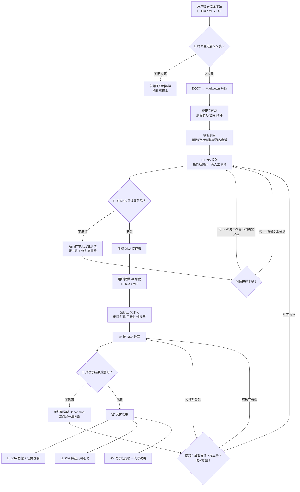

# Writing DNA · 个人写作风格守护者

让 AI 生成的内容"听起来像你写的"。

---

## 全流程总览

下图中标注 **🔵 用户确认** 的节点，是流程中需要你停下判断的地方。



> 流程中所有"用户确认"节点，你都可以跳过或直接接受默认结果。

---

## 关于样本

### 样本数量建议

| 篇数 | 效果 | 总字数参考 |
|:---:|:---|:---:|
| 1-4 篇 | ❌ 不够——无法区分单篇特点和稳定习惯 | < 1.7 万字 |
| **5 篇** | ⚠️ 下限——稳定特征刚好浮现，但不确定项偏多 | 约 2 万字 |
| **8 篇** | ✅ 最佳——不确定项收敛，特征基本确认 | 约 3.5 万字 |
| **12 篇** | ✅ 上限——特征饱和，再加边际收益极低 | 约 5 万字 |

### 样本类型多样性

**类型多样比数量堆叠更重要。**

如果你只交同一类文章（例如全是财政绩效报告），DNA 会混入大量行业模板，导致个人风格被淹没。理想配置：

- 覆盖 **3 种以上** 不同写作类型（如分析报告 / 方案建议 / 工作总结 / 公开文章）
- 来自 **不同委托方或受众**
- 尽量使用 **独著** 作品（合署作品会混入第二作者风格）

### 文件格式支持

| 格式 | 支持方式 |
|:---|:---|
| `.docx` | 自动转换（内置 DOCX→Markdown 链路） |
| `.md` / `.txt` | 直接读取 |
| 粘贴文本 | 用 `---` 分隔多篇 |
| 文件夹 | 自动扫描所有 `.docx` / `.md` / `.txt` |

---

## 关于模型

### DNA 提取阶段

DNA 提取主要依赖**人工分析 + 跨文档对比**，与使用哪个大模型关系不大。自动统计脚本（`scripts/test_sample_sufficiency.py`、`scripts/extract_dna.py`）辅助判断，但不替代人工判断。

### DNA 改写阶段

改写阶段对不同模型的敏感度较高。下表供参考：

| 模型 | 适合程度 | 说明 |
|:---|:---:|:---|
| **Claude（Sonnet / Opus）** | ⭐⭐⭐⭐⭐ | 规则遵循度高，建议表达和制度类改写表现稳定 |
| **ChatGPT（GPT-5 / 5.4）** | ⭐⭐⭐⭐ | 长句控制和信息密度还原好，建议语气偏稳 |
| **DeepSeek V4** | ⭐⭐⭐⭐ | 性价比高，中文理解出色，复杂制度描述偶有信息丢失 |

> 如果改写结果不理想，第一反应不应是加样本，而应换模型重跑。跨模型 Benchmark 设计见 `PROJECT_STATUS.md`。

### 模型选择对效果的实际影响

- **改写越保守的模型**，信息保留率越高，但风格转变越小
- **改写越激进的模型**，风格靠近度越高，但信息丢失风险越大
- 最佳实践：先用旗舰模型（Claude Opus / GPT-5.4）跑标准版，再看是否需要微调

---

## 快速上手

### 第一步：安装

```bash
# 克隆项目
git clone <项目地址>
cd skill项目

# 安装依赖（Python 3.10+）
pip install -r requirements.txt
```

> **依赖说明**：`mammoth` 用于 DOCX→Markdown 转换，`markdownify` 用于 HTML→Markdown，`matplotlib` + `Pillow` 用于生成 DNA 特征云图，`PyYAML` 读取配置文件。

### 第二步：放入样本

将你的 **5-8 篇过往作品**放入 `inputs/raw_docx_articles/`，支持 `.docx` / `.md` / `.txt`。

### 第三步：一键运行

```bash
# 查看当前状态和下一步建议
python run.py status

# 运行前置处理全链路（转换 → 过滤 → 模板剥离）
python run.py pipeline

# 提取DNA
python run.py extract --user-name 你的名字

# 放入AI草稿到 inputs/ai_drafts/ 后改写
python run.py rewrite
```

### 第四步：查看产出

| 产出 | 路径 |
|:---|:---|
| DNA画像（JSON） | `outputs/dna_profiles/<你的名字>-dna.json` |
| DNA热词图（PNG） | `outputs/dna_profiles/<你的名字>-dna_hotwords.png` |
| 改写成品稿 | `outputs/rewrite_runs/rewritten_draft.md` |
| 改写调试信息 | `outputs/rewrite_runs/rewrite_debug.json` |

### 高级用法：逐脚本调用

如果需要更精细的控制，也可以单独调用每个脚本：

```bash
# 前置处理链路
python scripts/docx_to_md.py --input inputs/raw_docx_articles/*.docx --output-dir inputs/normalized_markdown
python scripts/filter_non_prose.py --input inputs/normalized_markdown/*.md --output-dir inputs/filtered_markdown
python scripts/strip_template.py --input inputs/filtered_markdown/*.md --output-dir inputs/template_stripped_markdown

# 样本充足性诊断（可选，建议5篇以上运行）
python scripts/test_sample_sufficiency.py

# DNA提取
python scripts/extract_dna.py --input inputs/template_stripped_markdown/*.md --user-name 你的名字 --output outputs/dna_profiles/你的名字-dna.json

# DNA特征云可视化
python scripts/render_dna_feature_cloud.py

# AI味检测（可选）
python scripts/detect_ai_slop.py --text inputs/ai_drafts/你的草稿.md --dna outputs/dna_profiles/你的名字-dna.json

# 按DNA改写
python scripts/rewrite_with_dna.py --draft inputs/ai_drafts/你的草稿.md --dna outputs/dna_profiles/你的名字-dna.json --output-md outputs/rewrite_runs/rewritten_draft.md --output-json outputs/rewrite_runs/rewrite_debug.json

# 生成对比报告
python scripts/generate_report.py --original inputs/ai_drafts/你的草稿.md --rewritten outputs/rewrite_runs/rewritten_draft.md --dna outputs/dna_profiles/你的名字-dna.json --debug-json outputs/rewrite_runs/rewrite_debug.json --output-md outputs/rewrite_runs/report.md
```

---

## 项目结构速查

```
├── inputs/
│   ├── raw_docx_articles/      ← 你的原始 DOCX
│   ├── normalized_markdown/    ← DOCX 转换后的 Markdown
│   ├── filtered_markdown/      ← 非正文过滤后
│   ├── template_stripped_markdown/ ← 模板剥离后（DNA 提取输入）
│   └── ai_drafts/              ← AI 草稿（用于改写对比）
│
├── outputs/
│   ├── dna_profiles/           ← DNA 主输出 + 特征云
│   ├── rewrite_runs/           ← 改写结果 + 说明
│   └── debug/                  ← 测试报告（饱和度/留一法）
│
├── scripts/                    ← 处理脚本
├── docs/                       ← 项目设计文档
└── SKILL.md                    ← 完整 skill 流程说明
```

---

## 推荐阅读

- [SKILL.md](SKILL.md) — 完整 skill 流程定义（DNA 提取 + 改写流程）
- [PROJECT_STATUS.md](PROJECT_STATUS.md) — 项目进度、资源消耗、未完项
- [docs/writing-dna-architecture.md](docs/writing-dna-architecture.md) — 系统架构说明
