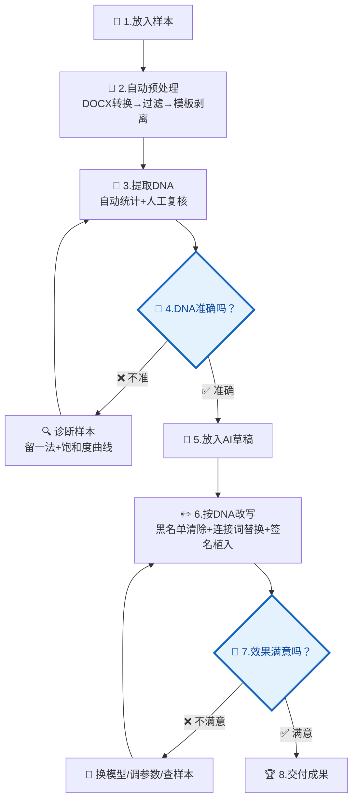

# Writing DNA · 个人写作风格守护者

让 AI 生成的内容"听起来像你写的"。

---

## 全流程总览

### 一句话流程

```
放样本 → 自动处理 → ⏸️ 你看DNA → 放草稿 → 自动改写 → ⏸️ 你看结果 → 完成
```

**只有 2 个地方需要你停下来看：**
- 🔵 **提取完 DNA 后** — 确认画像准不准
- 🔵 **改写完成后** — 确认效果好不好

其余全部自动执行。

---

### 完整流程图



> 🔵 **流程图中蓝色菱形 = 必须人工判断的节点，模型不能替你做决定**

### 🔵 第4步：DNA 准确吗？—— 你必须亲自检查这 4 项

模型提取完 DNA 后**会自动停下来等你确认**。你需要逐项检查：

| # | 检查什么 | 怎么判断 | 不对劲怎么办 |
|:---:|:---|:---|:---|
| 1 | **签名短语** | 这 15 个短语是不是你确实常用的？有没有"我从来没说过这个"？ | 指出不对的 → 模型帮你删/换 |
| 2 | **句长特征** | 平均句长、短句比例是否符合你的实际习惯？ | 告诉模型大概多少字一句 → 手动调整 |
| 3 | **黑名单词** | 列出的"你从不用的套话"，你是不是真的不用？有没有误杀自己常用的？ | 指出误杀的 → 从黑名单移除 |
| 4 | **开头/结尾** | `openers` / `closers` 是不是你惯用的起手/收尾方式？ | 提供你真实的开头/结尾示例 → 替换 |

**如果整体都不像** → 别急着重新提取，先跑样本测试：
```bash
python scripts/test_sample_sufficiency.py
```
测试会直接告诉你：是样本不够（补文档）、还是样本类型太单一（加不同类型的）、还是够了但提取规则要调。

---

## 关于样本

### 样本数量建议

| 篇数 | 效果 | 总字数参考 |
|:---:|:---|:---:|
| 1-4 篇 | ❌ 不够——无法区分单篇特点和稳定习惯 | < 1.7 万字 |
| **5 篇** | ⚠️ 下限——稳定特征刚好浮现，但不确定项偏多 | 约 2 万字 |
| **8 篇** | ✅ 最佳——不确定项收敛，特征基本确认 | 约 3.5 万字 |
| **12 篇** | ✅ 上限——特征饱和，再加边际收益极低 | 约 5 万字 |

> 💡 **不确定自己样本够不够？直接跑一下测试：**
> ```bash
> python scripts/test_sample_sufficiency.py
> ```
> 报告会告诉你留一法波动值和饱和度曲线结论（详见下方"效果不好怎么办"）。

---

### 样本类型多样性（重要！）

**类型多样比数量堆叠更重要。**

如果你只交同一类文章，DNA 会混入大量行业模板/固定格式，导致个人风格被淹没。

#### ✅ 好的样本组合

| 样本类型 | 提取什么 |
|:---|:---|
| 分析论证类（如报告、评估、调研） | 论证结构、制度词使用习惯、数据引用方式 |
| 总结规划类（如工作总结、方案建议） | 段落组织方式、总结句式、条目化表达 |
| 公开表达类（如文章、评论、演讲稿） | 表达灵活性、修辞偏好、语气变化 |
| 申请说服类（如申报书、请示函） | 说服性写作手法、措辞分寸感 |

**核心原则：让 DNA 提取器看到你在不同场合下的写作习惯，才能区分"你的风格"和"行业模板"。**

#### ❌ 不好的样本组合

```
❌ 同一类型 × N 篇       → DNA = 行业模板，不是你
❌ 同一项目初稿+终稿     → 内容高度重复，等于只有1篇
❌ 全是合署作品         → 混入第二作者风格
❌ 全是复制粘贴的模板   → 提取不到任何个人特征
```

#### 实际操作建议

- 覆盖 **3 种以上** 不同写作类型
- 来自 **不同场景或受众**
- 尽量使用 **独著** 作品
- 如果实在只有一种类型，至少确保 **时间跨度 > 半年**（体现风格演变）

### 文件格式支持

| 格式 | 支持方式 |
|:---|:---|
| `.docx` | 自动转换（内置 DOCX→Markdown 链路） |
| `.md` / `.txt` | 直接读取 |
| 粘贴文本 | 用 `---` 分隔多篇 |
| 文件夹 | 自动扫描所有 `.docx` / `.md` / `.txt` |

---

## 关于模型

### DNA 提取阶段

DNA 提取主要依赖**人工分析 + 跨文档对比**，与使用哪个大模型关系不大。自动统计脚本（`scripts/test_sample_sufficiency.py`、`scripts/extract_dna.py`）辅助判断，但不替代人工判断。

### DNA 改写阶段

改写阶段对不同模型的敏感度较高。下表供参考：

| 模型 | 适合程度 | 说明 |
|:---|:---:|:---|
| **Claude（Sonnet / Opus）** | ⭐⭐⭐⭐⭐ | 规则遵循度高，建议表达和制度类改写表现稳定 |
| **ChatGPT（GPT-5 / 5.4）** | ⭐⭐⭐⭐ | 长句控制和信息密度还原好，建议语气偏稳 |
| **DeepSeek V4** | ⭐⭐⭐⭐ | 性价比高，中文理解出色，复杂制度描述偶有信息丢失 |

> 如果改写结果不理想，第一反应不应是加样本，而应换模型重跑。跨模型 Benchmark 设计见 `PROJECT_STATUS.md`。

### 模型选择对效果的实际影响

- **改写越保守的模型**，信息保留率越高，但风格转变越小
- **改写越激进的模型**，风格靠近度越高，但信息丢失风险越大
- 最佳实践：先用旗舰模型（Claude Opus / GPT-5.4）跑标准版，再看是否需要微调

> ⚠️ **以上模型评分基于初步体验，正式跨模型 Benchmark 结果将在测试完成后更新到本文件。** 测试设计见 `PROJECT_STATUS.md` "跨模型 Benchmark" 章节。

---

## 效果不好怎么办？

DNA 画像不准？改写后不像你写的？**按顺序排查，不要盲目加样本或换模型。**

---

### 排查总览

```
问题出现
   ↓
① 跑样本充足性测试 ──→ 样本不够？ ──→ 补样本（不同类型）→ 重新提取
   ↓ 够
② 跑模板画像检查 ──→ 剥离有问题？ ──→ 调 strip_template 规则 → 重新剥离+提取
   ↓ 没问题
③ 检查 DNA 规则 ──→ 规则不对？ ──→ 手动调整 DNA JSON → 重新改写
   ↓ 没问题
④ 换模型 / 调参数 ──→ 重跑改写
```

---

### ① 样本充足性测试

**症状：** DNA 提取的特征很少、很泛，或者你觉得"这不像我"

```bash
python scripts/test_sample_sufficiency.py
```

报告输出到 `outputs/debug/sample_sufficiency_test.md`，看这两个指标：

| 指标 | ✅ 正常 | ⚠️ 需关注 | ❌ 有问题 |
|:---|:---|:---|:---|
| **留一法波动值** | < 0.05 | 0.05 ~ 0.15 | > 0.15 |
| **饱和度曲线** | 已趋于平缓 | 接近平缓 | 仍在上升 |

**根据结果操作：**

- **❌ 波动大 + 曲线未饱和** → 样本量不够，补 **2-3 篇不同类型**的文档，然后重新 `run.py extract`
- **⚠️ 波动中等 + 曲线趋平** → 基本可用，但某些特征不稳定。先继续往下排查第②步
- **✅ 波动小 + 曲线已饱和** → 样本没问题，问题在别处，直接看第②步

---

### ② 模板剥离检查

**症状：** DNA 里混入大量套话/格式化内容，或者提取出的特征太少

```bash
python scripts/extract_template_profile.py --input inputs/filtered_markdown/*.md --output-json outputs/debug/template_profile.json --output-md outputs/debug/template_profile.md
```

查看 `template_profile.md` 中的 **平均保留率**：

| 保留率 | 含义 | 怎么办 |
|:---:|:---|:---|
| **< 30%** | 剥离过度，个人正文被误删 | 编辑 `scripts/strip_template.py`，把误删的模式从规则中移除或放宽，然后重新跑 `run.py pipeline` + `run.py extract` |
| **30% ~ 70%** | 正常范围 | 继续看第③步 |
| **> 70%** | 剥离不足，模板噪声混入 DNA | 编辑 `scripts/strip_template.py`，补充遗漏的模板模式（参考报告中"跨文档重复段落"），然后重新跑 |

> 💡 报告中的"模板级标题"和"个人正文标题"分类会告诉你哪些内容被排除了、哪些保留了。

---

### ③ DNA 规则检查

**症状：** 样本和模板都没问题，但改写后的文章还是不像你的风格

打开 `outputs/dna_profiles/<你的名字>-dna.json`，逐条检查：

| 检查项 | 问题表现 | 调整方式 |
|:---|:---|:---|
| **句长分布** | 改写后句子忽长忽短 | 检查 `sentence_length` 区间是否与原文匹配 |
| **连接词偏好** | 出现你不常用的连接词 | 检查 `connectors` 黑名单/白名单是否完整 |
| **签名短语** | 没有植入或植入位置生硬 | 检查 `signature_phrases` 是否有足够的示例句 |
| **制度词/高频词** | 用词风格偏差大 | 检查 `vocabulary_preferences` 词表是否准确 |

手动编辑 DNA JSON 后，重新运行：

```bash
python run.py rewrite
```

---

### ④ 模型与参数调优

**症状：** 以上三步都确认没问题，但改写质量仍不满意

按以下优先级尝试：

1. **换模型** — 不同模型对改写规则的遵循度差异很大：
   - Claude：规则遵循最严格
   - ChatGPT：信息保留最好
   - DeepSeek：性价比最高

2. **调参数** — 编辑 `config.yaml`：
   - `rewrite_aggressiveness`: 降低 = 更保守（更像原文），提高 = 更激进（更像你的风格）
   - `signature_density`: 签名短语植入密度

3. **检查输入稿** — 确保 AI 草稿本身信息完整，没有缺失段落

---

### 快速定位对照表

| 你遇到的问题 | 最可能的原因 | 先跑哪个测试 |
|:---|:---|:---|
| DNA 特征很少、很空泛 | 样本量不够 或 类型太单一 | ① 样本充足性测试 |
| DNA 里有很多套话/格式语 | 模板没剥干净 | ② 模板画像检查 |
| DNA 提取了但改写后不像 | DNA 规则需要微调 | ③ DNA 规则检查 |
| 改写后信息丢失严重 | 模型太激进 | ④ 换保守模型 |
| 改写后风格变化太小 | 模型太保守 或 参数太低 | ④ 提高激进度/换模型 |

---

## 快速上手

### 第一步：安装

```bash
# 克隆项目
git clone <项目地址>
cd skill项目

# 安装依赖（Python 3.10+）
pip install -r requirements.txt
```

> **依赖说明**：`mammoth` 用于 DOCX→Markdown 转换，`markdownify` 用于 HTML→Markdown，`matplotlib` + `Pillow` 用于生成 DNA 特征云图，`PyYAML` 读取配置文件。

### 第二步：放入样本

将你的 **5-8 篇过往作品**放入 `inputs/raw_docx_articles/`，支持 `.docx` / `.md` / `.txt`。

### 第三步：一键运行

```bash
# 查看当前状态和下一步建议
python run.py status

# 运行前置处理全链路（转换 → 过滤 → 模板剥离）
python run.py pipeline

# 提取DNA
python run.py extract --user-name 你的名字

# 放入AI草稿到 inputs/ai_drafts/ 后改写
python run.py rewrite
```

### 第四步：查看产出

| 产出 | 路径 |
|:---|:---|
| DNA画像（JSON） | `outputs/dna_profiles/<你的名字>-dna.json` |
| DNA热词图（PNG） | `outputs/dna_profiles/<你的名字>-dna_hotwords.png` |
| 改写成品稿 | `outputs/rewrite_runs/rewritten_draft.md` |
| 改写调试信息 | `outputs/rewrite_runs/rewrite_debug.json` |

### 高级用法：逐脚本调用

如果需要更精细的控制，也可以单独调用每个脚本：

```bash
# 前置处理链路
python scripts/docx_to_md.py --input inputs/raw_docx_articles/*.docx --output-dir inputs/normalized_markdown
python scripts/filter_non_prose.py --input inputs/normalized_markdown/*.md --output-dir inputs/filtered_markdown
python scripts/strip_template.py --input inputs/filtered_markdown/*.md --output-dir inputs/template_stripped_markdown

# 样本充足性诊断（可选，建议5篇以上运行）
python scripts/test_sample_sufficiency.py

# 模板画像提取（可选，查看模板vs个人风格分界线）
python scripts/extract_template_profile.py --input inputs/filtered_markdown/*.md --output-json outputs/debug/template_profile.json --output-md outputs/debug/template_profile.md

# DNA提取
python scripts/extract_dna.py --input inputs/template_stripped_markdown/*.md --user-name 你的名字 --output outputs/dna_profiles/你的名字-dna.json

# DNA特征云可视化
python scripts/render_dna_feature_cloud.py

# AI味检测（可选）
python scripts/detect_ai_slop.py --text inputs/ai_drafts/你的草稿.md --dna outputs/dna_profiles/你的名字-dna.json

# 按DNA改写
python scripts/rewrite_with_dna.py --draft inputs/ai_drafts/你的草稿.md --dna outputs/dna_profiles/你的名字-dna.json --output-md outputs/rewrite_runs/rewritten_draft.md --output-json outputs/rewrite_runs/rewrite_debug.json

# 生成对比报告
python scripts/generate_report.py --original inputs/ai_drafts/你的草稿.md --rewritten outputs/rewrite_runs/rewritten_draft.md --dna outputs/dna_profiles/你的名字-dna.json --debug-json outputs/rewrite_runs/rewrite_debug.json --output-md outputs/rewrite_runs/report.md
```

---

## 项目结构速查

```
├── inputs/
│   ├── raw_docx_articles/      ← 你的原始 DOCX
│   ├── normalized_markdown/    ← DOCX 转换后的 Markdown
│   ├── filtered_markdown/      ← 非正文过滤后
│   ├── template_stripped_markdown/ ← 模板剥离后（DNA 提取输入）
│   └── ai_drafts/              ← AI 草稿（用于改写对比）
│
├── outputs/
│   ├── dna_profiles/           ← DNA 主输出 + 特征云
│   ├── rewrite_runs/           ← 改写结果 + 说明
│   └── debug/                  ← 测试报告（饱和度/留一法）
│
├── scripts/                    ← 处理脚本
├── docs/                       ← 项目设计文档
└── SKILL.md                    ← 完整 skill 流程说明
```

---

## 推荐阅读

- [SKILL.md](SKILL.md) — 完整 skill 流程定义（DNA 提取 + 改写流程）
- [PROJECT_STATUS.md](PROJECT_STATUS.md) — 项目进度、资源消耗、未完项
- [docs/writing-dna-architecture.md](docs/writing-dna-architecture.md) — 系统架构说明
