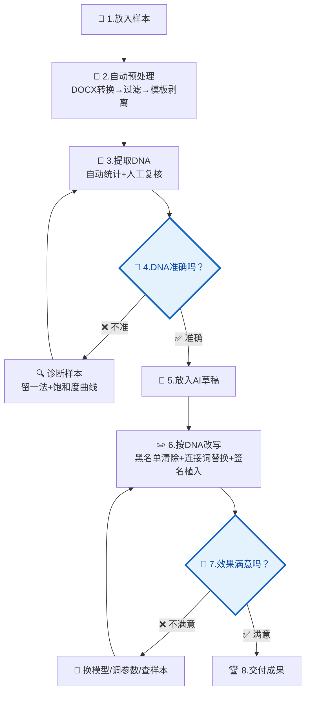

# Writing DNA · 个人写作风格守护者

[English](https://github.com/dvdxfv/skill-writing-dna/blob/main/README_EN.md) | 中文

让 AI 生成的内容"听起来像你写的"。

> 🔌 **在哪能用**：Trae / Cursor / Claude Code / VS Code (Copilot) / CodeX，五个平台均已适配。克隆后 `pip install -r requirements.txt`，Python 3.10+ 即可。

---

## 全流程总览

### 一句话流程

```
放样本 → 自动处理 → ⏸️ 你看DNA → 放草稿 → 自动改写 → ⏸️ 你看结果 → 完成
```

**只有 2 个地方需要你停下来看：**
- 🔵 **提取完 DNA 后** — 确认画像准不准
- 🔵 **改写完成后** — 确认效果好不好

其余全部自动执行。

---

### 完整流程图



> 🔵 **流程图中蓝色菱形 = 必须人工判断的节点，模型不能替你做决定**

<!-- 图1：AI味体检结果 -->

*图1 · AI 味体检：分数越高 AI 味越重，下方列明每项套话的命中位置*

### 🔵 第4步：DNA 准确吗？—— 你必须亲自检查这 4 项

模型提取完 DNA 后**会自动停下来等你确认**，它会在对话里直接列出来给你看，不用去翻文件：

| # | 模型会给你看什么 | 怎么判断对不对 | 不对劲怎么办 |
|:---:|:---|:---|:---|
| 1 | 你最爱用的 15 个高频短语（+ 热词云图） | 有没有"我从来没说过这个"？少了自己常用的词？ | 告诉模型"XX 不是我说的，换成 YY" |
| 2 | "你平均每句 XX 字，短句占 XX%" | 跟你平时的句子节奏像不像？你喜欢长句还是短句？ | 告诉模型"我一般 XX 字一句" |
| 3 | "以下是判定为你从不用的 AI 套话" | 有没有把自己的口头禅误杀了？ | 指出误杀项 → 模型帮你从黑名单移除 |
| 4 | "你的文章通常以……开头，以……结尾" | 跟你平时起手/收尾方式像不像？ | 复制你真实的开头/结尾发给模型替换 |

**如果整体都不像** → 别急着重新提取，先跑样本测试：
```bash
python scripts/test_sample_sufficiency.py
```
测试会直接告诉你：是样本不够（补文档）、还是样本类型太单一（加不同类型的）、还是够了但提取规则要调。

<!-- 图2：DNA 热词云图 -->

*图2 · DNA 热词云图：字越大用词越高频，一眼看出你的标志性表达*

---

### 🔵 第7步：效果满意吗？—— 你必须亲自检查这 4 项

模型改写完 + 生成对比报告后**会自动停下来等你确认**，它会在对话里直接展示给你看：

| # | 模型会给你看什么 | 怎么判断对不对 | 不对劲怎么办 |
|:---:|:---|:---|:---|
| 1 | 改写前后双栏对比 + "AI 味分数从 X 降到 Y，消除了 Z 个套话" | 读一遍改写稿，还有没有"赋能/重塑/综上所述"那股味道？ | 指出残留的句子 → 针对性重写 |
| 2 | "植入了你的 N 个签名短语：XX、YY……" | 这些短语嵌进去自然吗？读起来像不像你在说话？ | 指出生硬的地方 → 调整后重跑 |
| 3 | 原文 vs 改写稿的并行对比 | 原文的事实、数字、结论都还在吗？有没有遗漏或歪曲？ | 指出丢失的信息 → 补回 |
| 4 | 完整的改写稿全文 | 整体读下来能不能直接发布/提交？还是还得自己改一轮？ | "还需微调" → 指出具体段落 → 定点修改 |

**如果整体都不满意** → 别急着反复改写，按这个顺序排查：
1. **DNA 准不准？** — 回看热词图和签名短语，第4步是不是草率确认的
2. **样本够不够？** — `python scripts/test_sample_sufficiency.py`
3. **换个模型试试** — 不同模型对风格改写的表现差异很大

<!-- 图3：改写前后对比 -->

*图3 · 改写前后对比：左原稿右改写，AI 味分数降了多少一目了然*

### ✅ 第8步：交付

确认满意后，模型会自动交付 Markdown 成稿、对比报告和调试数据；如果你需要，还可以再转一份 DOCX：

**默认你拿到的是 Markdown 版本**（`rewritten_draft.md`），适合直接在 Obsidian、Typora 等 Markdown 编辑器里使用。

**模型还会问你："要不要转一份 DOCX？"** 如果你用 WPS / Word，说"要"，它就自动帮你转成排版好的 `.docx` 文件——黑体标题 + 仿宋正文，打开直接就是正常的文档，不会像 MD 那样一粘贴全是 `#` `**` 乱码。

所有交付物都在 `outputs/rewrite_runs/` 下：

| 文件 | 什么场景用 |
|:---|:---|
| `report.md` | 📊 改写前后对比报告，读一遍确认质量 |
| `rewritten_draft.md` | 📝 改写后的成品 Markdown |
| `rewritten_draft.docx` | 📄 WPS/Word 直接打开，排版好的版本（选转） |
| `rewrite_debug.json` | 🔧 详细指标数据（一般不用管） |

<!-- 图4：MD 直接复制到 WPS 乱码 vs DOCX 转换后排版效果 -->

*图4 · MD 乱码 vs DOCX 转换：左边 Markdown 直接粘贴到 WPS 不可读，右边自动转出的排版文档整洁如初*

| MD 直接粘贴到 WPS | DOCX 转换后 |
|:---:|:---:|
|  |  |

---

## 关于样本

### 样本数量建议

| 篇数 | 效果 | 总字数参考 |
|:---:|:---|:---:|
| 1-4 篇 | ❌ 不够——无法区分单篇特点和稳定习惯 | < 1.7 万字 |
| **5 篇** | ⚠️ 下限——稳定特征刚好浮现，但不确定项偏多 | 约 2 万字 |
| **8 篇** | ✅ 最佳——不确定项收敛，特征基本确认 | 约 3.5 万字 |
| **12 篇** | ✅ 上限——特征饱和，再加边际收益极低 | 约 5 万字 |

> 💡 **不确定自己样本够不够？直接跑一下测试：**
> ```bash
> python scripts/test_sample_sufficiency.py
> ```
> 报告会告诉你留一法波动值和饱和度曲线结论（详见下方"效果不好怎么办"）。

---

### 样本类型多样性（重要！）

**类型多样比数量堆叠更重要。**

如果你只交同一类文章，DNA 会混入大量行业模板/固定格式，导致个人风格被淹没。

#### ✅ 好的样本组合

| 样本类型 | 提取什么 |
|:---|:---|
| 分析论证类（如报告、评估、调研） | 论证结构、制度词使用习惯、数据引用方式 |
| 总结规划类（如工作总结、方案建议） | 段落组织方式、总结句式、条目化表达 |
| 公开表达类（如文章、评论、演讲稿） | 表达灵活性、修辞偏好、语气变化 |
| 申请说服类（如申报书、请示函） | 说服性写作手法、措辞分寸感 |

**核心原则：让 DNA 提取器看到你在不同场合下的写作习惯，才能区分"你的风格"和"行业模板"。**

#### ❌ 不好的样本组合

```
❌ 同一类型 × N 篇       → DNA = 行业模板，不是你
❌ 同一项目初稿+终稿     → 内容高度重复，等于只有1篇
❌ 全是合署作品         → 混入第二作者风格
❌ 全是复制粘贴的模板   → 提取不到任何个人特征
```

#### 实际操作建议

- 覆盖 **3 种以上** 不同写作类型
- 来自 **不同场景或受众**
- 尽量使用 **独著** 作品
- 如果实在只有一种类型，至少确保 **时间跨度 > 半年**（体现风格演变）

### 文件格式支持

| 格式 | 支持方式 |
|:---|:---|
| `.docx` | 自动转换（内置 DOCX→Markdown 链路） |
| `.md` / `.txt` | 直接读取 |
| 粘贴文本 | 用 `---` 分隔多篇 |
| 文件夹 | 自动扫描所有 `.docx` / `.md` / `.txt` |

---

## 关于模型

### DNA 提取阶段

DNA 提取主要依赖**人工分析 + 跨文档对比**，与使用哪个大模型关系不大。自动统计脚本（`scripts/test_sample_sufficiency.py`、`scripts/extract_dna.py`）辅助判断，但不替代人工判断。

### DNA 改写阶段

改写阶段对不同模型的敏感度较高。以下为跨模型 Benchmark 实测结果：

#### 已测试模型

| 模型 | 适合程度 | 综合评分 | 评审模型 | DNA遵循度 | AI味清除 | 信息完整性 | 风格相似度 | 改写策略 |
|:---|:---:|:---:|:---|:---:|:---:|:---:|:---:|:---|
| **Claude Opus** | ⭐⭐⭐⭐ | 8.5 / 10 | DeepSeek V4 Pro | ⭐9.0 | 8.0 | ⭐9.0 | 8.5 | 结构转化 |
| **ChatGPT 5.5** | ⭐⭐⭐⭐ | 8.3 / 10 | DeepSeek V4 Pro | 8.5 | 8.5 | ⭐9.0 | 8.0 | 均衡转化 |
| **DeepSeek V4 Pro** | ⭐⭐⭐⭐ | 8.0 / 10 | ChatGPT 5.5 | 8.0 | 7.5 | 8.5 | 8.0 | 主动压缩 |
| **GLM 5V Turbo** | ⭐⭐ | 6.5 / 10 | DeepSeek V4 Pro | 6.5 | 6.0 | ⭐9.5 | 5.5 | 极度保守 |
| **Kimi K2.6** | ⭐⭐ | 6.5 / 10 | DeepSeek V4 Pro | 6.5 | 6.0 | ⭐9.5 | 5.5 | 极度保守 |
| **千问 3.6 Plus** | ⭐⭐ | 6.5 / 10 | DeepSeek V4 Pro | 6.5 | 6.0 | ⭐9.5 | 5.5 | 极度保守 |
| **千问 3.5 Plus** | ⭐⭐ | 6.5 / 10 | DeepSeek V4 Pro | 6.5 | 6.0 | ⭐9.5 | 5.5 | 极度保守 |

> 当前最佳为 Claude Opus（8.5），首次在"白话语段→枚举式结构"层面做出实质性格式转换。ChatGPT 5.5（8.3）和 DeepSeek V4 Pro（8.0）分别在均衡性和压缩力度上各有优势。三者均明显优于四款保守模型（6.5）。

#### Claude Opus 详细评审

> **评审模型**：DeepSeek V4 Pro · **评审时间**：2026-05-17 · **改写稿**：直接提交全文（用户粘贴），未单独落盘

Claude Opus 在此次改写中采用了与前六个模型完全不同的策略——"结构转化"。它不是在做同义替换或段落压缩，而是在 **将白话叙述改写为枚举式结构**，这是 DNA 规则 2 和规则 3 的核心要求，此前没有任何模型做到这个层面：

- **DNA 规则遵循度 9.0**：Claude 是首个在"白话语段→枚举结构"层面做转化的模型。三个关键点位：项目实施流程从长句"依据…填写…经…交由…"转为"一是…二是…三是…四是…"；主要绩效从散句"按照收支两条线原则…全年累计保障…按月缴纳…"转为枚举式总结；经验做法从时间线叙述转为"按'人员推送—费用核算—缴费推送—资金保障'流程链：一是…二是…三是…四是…"。这直接命中了 DNA 画像核心特征——"偏好枚举式过渡"
- **AI 味清除 8.0**：政策背景段做了压缩但保留了国企改革的必要语境，"亟需"等词仍带轻微模板味；整体干净，未发现典型 AI 黑名单词
- **信息完整性 9.0**：1518 万元、6782 人次、90.14 分、12 家企业、政策文号、指标得分、满意度分项全部保留
- **风格相似度 8.5**：枚举式结构的转换使输出在"结构习惯"层面而非仅"用词"层面接近 DNA 画像；"产权相对清晰、权责相对分明"中"相对"的加入体现了制度分析者的审慎语气——这与 DNA 画像中"避免过高承诺/不用极致副词"的要求一致
- **改写创新性 8.5**：不是同义替换，不是段落压缩，而是 **结构性调整**——识别出哪些段落适合转化为枚举式表达并实际执行了转换

**结论**：Claude Opus（8.5）是当前表现最好的模型，关键差异在于它触及了"格式层面"的改写——将白话语段转化为 DNA 指定的枚举式结构，而非停留在用词替换层面。这是此前五个模型（包括 ChatGPT 5.5 和 DeepSeek V4 Pro）都没有做到的。

**限制**：输出文本末尾在"三是榆…"处截断，未看到建议章节的完整输出，以上评估基于已收到的 3000+ 字改写内容。

#### ChatGPT 5.5 详细评审

> **评审模型**：DeepSeek V4 Pro · **评审时间**：2026-05-17 · **改写稿**：`outputs/model_benchmarks/chatgpt_5_5_rewritten.md` · **AI 味检测**：`outputs/model_benchmarks/chatgpt_5_5_slop_report.json`（得分 1/100，原始输入为 2/100）

ChatGPT 5.5 在此次改写中采用"均衡转化"策略——在风格转化和信息保留之间找到了比 DeepSeek V4 Pro 更好的平衡点：

- **DNA 规则遵循度 8.5**：段首判断句落实到位（如"项目支出内容围绕改制企业职工保障开展""项目支付流程已形成基本闭环""绩效管理水平仍显不足"），建议部分严格遵循"建议+主体+动作+内容"句式，问题分析使用"一是…二是…三是…"枚举；基础章节的风格转化略弱于问题/建议章节，但整体遵循度高于 DeepSeek V4 Pro
- **AI 味清除 8.5**：AI 套话检测仅 1/100（原始输入 2/100），命中的 11 条全部为政策文件固定表述（如"全面实施预算绩效管理"）或中性公文用语（"再次""构建""深入"），均不是典型 AI 水词；"赋能/重塑/生态/一站式/综上所述"等硬性黑名单词未出现
- **信息完整性 9.0**：1518 万元、6782 人次、90.14 分、12 家企业、各项指标得分、满意度分项、政策文号、评价依据清单全部完整保留；评价工作过程和阶段性目标等细节也被保留，未出现 DeepSeek V4 Pro 的过度压缩问题
- **风格相似度 8.0**：问题分析段（"一是…二是…三是…"每项附事实、因果隐含在事实中）和建议段（建制式措辞、先方向后方案）最接近 DNA 画像；政策背景段虽做了缩减但仍有"发挥了重要作用""具有较强的民生属性"等偏通用公文表达
- **改写创新性 7.5**：主要是重组句式、压缩冗余、强化判断句，而非大幅重构段落结构；改写策略偏稳健，优点是可读性强、无需大量人工补回，缺点是风格突破幅度不如 DeepSeek V4 Pro 激进

**结论**：ChatGPT 5.5 是当前已测模型中综合表现最好的版本（8.3），在"像本人写的"和"信息不丢"之间取得了最实用的平衡。适合作为主改写模型直接使用，人工复核量低于 DeepSeek V4 Pro。如需更激进风格突破仍可选用 DeepSeek V4 Pro，代价是更高的信息补回成本。

#### DeepSeek V4 Pro 详细评审

> **评审模型**：ChatGPT 5.5 · **评审时间**：2026-05-17 · **输入文件**：`outputs/dna_profiles/user_dna_profile.md` + `outputs/rewrite_runs/new_ai_draft_effective_input.md` · **详细记录**：`outputs/reports/deepseek_v4_pro_review_chatgpt55.md`

DeepSeek V4 Pro 在此次改写任务中明显区别于前四个保守模型，属于"主动压缩 + 风格转化"路线：

- **DNA 规则遵循度 8.0**：能落实段首判断、并列展开、制度化建议和规范语气，问题与建议部分最接近 DNA 要求；但基础情况、评价过程等模板性章节仍保留较多原文组织方式
- **AI 味清除 7.5**：删除或压缩了部分宏大背景、重复政策语和空泛修饰，整体更紧凑；但"优化经济结构、激发市场主体活力""兜牢民生底线"等通用公文表达仍有残留
- **信息完整性 8.5**：1518 万元、6782 人次、90.14 分、12 家企业、各项指标得分等核心事实保留完整；但评价依据、工作过程、部分满意度分项和阶段性目标细节被压缩，存在轻微信息损耗
- **风格相似度 8.0**：相比原稿更强调"判断句 + 事实支撑 + 建制建议"，问题分析和政策建议段落较符合用户 DNA；不足是部分章节为了精简而弱化了报告体例的完整展开
- **改写创新性 8.0**：不只是同义替换，而是主动调整段落密度、删除模板噪声、重组问题与建议表达；需要人工复核信息边界后再作为定稿使用

**结论**：DeepSeek V4 Pro 是当前已测模型中首个真正产生风格转化的版本，适合作为"第二轮风格主改写"使用。最佳用法是先用保守模型校验信息完整性，再用 DeepSeek V4 Pro 做风格压缩，最后人工补回被压缩过度的依据、过程和分项数据。

#### 保守模型共同结论

以下四个模型表现高度一致，均以信息安全为优先，适合作为事实保真校验，不适合作为主改写模型。

#### 千问 3.6 Plus 详细评审

> **评审模型**：DeepSeek V4 Pro · **评审时间**：2026-05-17 · **输入文件**：`outputs/dna_profiles/user_dna_profile.md` + `outputs/rewrite_runs/new_ai_draft_effective_input.md`

千问 3.6 Plus 与千问 3.5 Plus 在此次改写任务上的表现无实质差异，各项得分完全相同：

- **DNA 规则遵循度 6.5**：8 条规则形式上均被遵守，但改写后与原文差异极小，未展现 DNA 驱动的风格转化
- **AI 味清除 6.0**：原文为政府公文，AI 套话基准含量低，实际清理幅度有限
- **信息完整性 9.5**：全部关键数据（1518 万、6782 人、90.14 分）、政策文号、企业名称、指标得分完整保留，无丢失
- **风格相似度 5.5**：改写后与原文高度相似——核心问题是输入稿与 DNA 来源样本属于同一文类，模型倾向于"不动比动好"
- **改写创新性 4.0**：整体偏向微调而非改写，缺乏风格驱动的主动转化

**结论**：千问系列（3.5/3.6）在公文类改写任务上均展现出"极度保守"特性——信息保真度极高但风格转变零提升。版本升级未改变这一倾向。建议作为"第一轮安全校验"使用，核心改写任务交给改写策略更激进的模型。

#### 千问 3.5 Plus 详细评审

> **评审模型**：DeepSeek V4 Pro · **评审时间**：2026-05-17 · 得分与 3.6 Plus 完全一致，详见上方 3.6 Plus 评测，此处不再重复展开。

#### Benchmarks 总结

共测试 **7 个模型**，评测结果按策略类型分为三个梯队：

| 梯队 | 模型 | 评分 | 策略 | 定位 |
|:---:|:---|:---:|:---|:---|
| 🥇 | **Claude Opus** | **8.5** | 结构转化 | 主改写——格式层面改写，白话语段→枚举结构 |
| 🥈 | **ChatGPT 5.5** | 8.3 | 均衡转化 | 主改写——风格与信息保留最平衡 |
| 🥉 | **DeepSeek V4 Pro** | 8.0 | 主动压缩 | 次改写——风格突破最大胆，需人工补回 |
| — | GLM 5V Turbo | 6.5 | 极度保守 | 安全校验——信息零丢失，风格零转化 |
| — | Kimi K2.6 | 6.5 | 极度保守 | 安全校验——同上 |
| — | 千问 3.6 Plus | 6.5 | 极度保守 | 安全校验——同上 |
| — | 千问 3.5 Plus | 6.5 | 极度保守 | 安全校验——同上 |

**核心发现：**

1. **信息安全和风格转化是互斥需求**——没有模型能在两个维度同时拿到 9.0+
2. **改写存在三个层次**：用词替换（所有保守模型）→ 段落重组（DS V4 Pro、ChatGPT 5.5）→ 格式结构转化（Claude Opus）
3. **同一文类输入是评测的关键变量**：原文与 DNA 来源样本同属公文类时，模型倾向于"不动比动好"，这是保守模型集体 6.5 分的根本原因
4. **AI 味检测工具的参考价值有限**：原文已含公文模板语（非典型 AI 水词），检测分数模型间差异不显著（1-2/100）

#### 模型选型建议

| 场景 | 推荐模型 | 原因 |
|:---|:---|:---|
| 日常改写，直接可用 | **ChatGPT 5.5** | 均衡性最好，人工复核量最小 |
| 追求最大风格突破 | **Claude Opus** | 唯一做格式层改写，DNA 遵循度最高 |
| 预算敏感/大批量 | **DeepSeek V4 Pro** | 性价比最优，激进压缩可配合人工补回 |
| 事实保真校验 | 千问/Kimi/GLM | 信息零丢失，适合做第一轮安全校验 |

> 每个模型的评分由**另一独立模型**交叉评审完成，确保评分客观。完整 Benchmark 设计及过程记录见 `PROJECT_STATUS.md`。

---

## 效果不好怎么办？

DNA 画像不准？改写后不像你写的？**按顺序排查，不要盲目加样本或换模型。**

---

### 排查总览

```
问题出现
   ↓
① 跑样本充足性测试 ──→ 样本不够？ ──→ 补样本（不同类型）→ 重新提取
   ↓ 够
② 跑模板画像检查 ──→ 剥离有问题？ ──→ 调 strip_template 规则 → 重新剥离+提取
   ↓ 没问题
③ 检查 DNA 规则 ──→ 规则不对？ ──→ 手动调整 DNA JSON → 重新改写
   ↓ 没问题
④ 换模型 / 调参数 ──→ 重跑改写
```

---

### ① 样本充足性测试

**症状：** DNA 提取的特征很少、很泛，或者你觉得"这不像我"

```bash
python scripts/test_sample_sufficiency.py
```

报告输出到 `outputs/debug/sample_sufficiency_test.md`，看这两个指标：

| 指标 | ✅ 正常 | ⚠️ 需关注 | ❌ 有问题 |
|:---|:---|:---|:---|
| **留一法波动值** | < 0.05 | 0.05 ~ 0.15 | > 0.15 |
| **饱和度曲线** | 已趋于平缓 | 接近平缓 | 仍在上升 |

**根据结果操作：**

- **❌ 波动大 + 曲线未饱和** → 样本量不够，补 **2-3 篇不同类型**的文档，然后重新 `run.py extract`
- **⚠️ 波动中等 + 曲线趋平** → 基本可用，但某些特征不稳定。先继续往下排查第②步
- **✅ 波动小 + 曲线已饱和** → 样本没问题，问题在别处，直接看第②步

---

### ② 模板剥离检查

**症状：** DNA 里混入大量套话/格式化内容，或者提取出的特征太少

```bash
python scripts/extract_template_profile.py --input inputs/filtered_markdown/*.md --output-json outputs/template_profiles/template_profile.json --output-md outputs/template_profiles/template_profile.md
```

查看 `template_profile.md` 中的 **平均保留率**：

| 保留率 | 含义 | 怎么办 |
|:---:|:---|:---|
| **< 30%** | 剥离过度，个人正文被误删 | 编辑 `scripts/strip_template.py`，把误删的模式从规则中移除或放宽，然后重新跑 `run.py pipeline` + `run.py extract` |
| **30% ~ 70%** | 正常范围 | 继续看第③步 |
| **> 70%** | 剥离不足，模板噪声混入 DNA | 编辑 `scripts/strip_template.py`，补充遗漏的模板模式（参考报告中"跨文档重复段落"），然后重新跑 |

> 💡 报告中的"模板级标题"和"个人正文标题"分类会告诉你哪些内容被排除了、哪些保留了。

---

### ③ DNA 规则检查

**症状：** 样本和模板都没问题，但改写后的文章还是不像你的风格

打开 `outputs/dna_profiles/<你的名字>-dna.json`，逐条检查：

| 检查项 | 问题表现 | 调整方式 |
|:---|:---|:---|
| **句长分布** | 改写后句子忽长忽短 | 检查 `sentence_length` 区间是否与原文匹配 |
| **连接词偏好** | 出现你不常用的连接词 | 检查 `connectors` 黑名单/白名单是否完整 |
| **签名短语** | 没有植入或植入位置生硬 | 检查 `signature_phrases` 是否有足够的示例句 |
| **制度词/高频词** | 用词风格偏差大 | 检查 `vocabulary_preferences` 词表是否准确 |

手动编辑 DNA JSON 后，重新运行：

```bash
python run.py rewrite
```

---

### ④ 模型与参数调优

**症状：** 以上三步都确认没问题，但改写质量仍不满意

按以下优先级尝试：

1. **换模型** — 不同模型对改写规则的遵循度差异很大：
   - Claude：规则遵循最严格
   - ChatGPT：信息保留最好
   - DeepSeek：性价比最高

2. **调参数** — 编辑 `config.yaml`：
   - `rewrite_aggressiveness`: 降低 = 更保守（更像原文），提高 = 更激进（更像你的风格）
   - `signature_density`: 签名短语植入密度

3. **检查输入稿** — 确保 AI 草稿本身信息完整，没有缺失段落

---

### 快速定位对照表

| 你遇到的问题 | 最可能的原因 | 先跑哪个测试 |
|:---|:---|:---|
| DNA 特征很少、很空泛 | 样本量不够 或 类型太单一 | ① 样本充足性测试 |
| DNA 里有很多套话/格式语 | 模板没剥干净 | ② 模板画像检查 |
| DNA 提取了但改写后不像 | DNA 规则需要微调 | ③ DNA 规则检查 |
| 改写后信息丢失严重 | 模型太激进 | ④ 换保守模型 |
| 改写后风格变化太小 | 模型太保守 或 参数太低 | ④ 提高激进度/换模型 |

---

## 能力边界

这个工具改的是**"怎么写"**，不改**"写了什么结构"**。以下限制请提前了解，避免不切实际的期望：

### 不能做的事

| 限制 | 原因 |
|:---|:---|
| **不能跨标题改写全文结构** | 改写以段落/标题段为单元，不会移动或重组章节顺序 |
| **不能还原原始 DOCX 排版** | DOCX→MD 转换丢失字体、字号、页边距。最终 DOCX 使用默认中文排版模板 |
| **不能 100% 保证标题层级识别准确** | 原文若未使用 WPS/Word 大纲样式，标题识别依赖文本特征推断 |
| **不能处理图片、图表、附件** | 文本清洗阶段已移除 |

### 交付格式

满意确认后，交付两份文件：

| 格式 | 适用场景 |
|:---|:---|
| `.md` | 纯文本阅读、版本控制、二次编辑 |
| `.docx` | WPS / Word 直接打开查看排版效果 |

DOCX 由 `scripts/md_to_docx.py` 生成（依赖 pandoc），自动配置黑体标题 + 仿宋正文，WPS 打开不乱码。

---

## 快速上手

> **支持的 AI 编程工具：** Trae / Cursor / Claude Code / VS Code Copilot / CodeX — 项目的 `WRITING_DNA.md` 已同步到各平台的规则目录（`.cursor/rules/`、`.claude/`、`.github/`、`.codex/rules/`），Python 脚本通用。打开项目即生效。
>
> **两种使用方式：** 推荐在 Trae / Cursor 等工具中**对话式使用**（直接说话，AI 自动执行脚本）；也可以**命令行使用**（手动跑 Python 脚本）。

### 方式一：对话式使用（推荐）

在 Trae / Cursor / Claude Code 等工具中打开项目文件夹，直接说话即可：

**提取 DNA：**
```
帮我把 inputs/raw_docx_articles/ 里的文章提取写作 DNA，用户名叫「你的名字」
```
AI 自动完成预处理 + DNA 提取，然后在对话中展示确认清单——你只需要回复"准，继续"或指出需要修正的项。

**改写 AI 草稿：**
```
用我的 DNA 改写 inputs/ai_drafts/我的草稿.md，去掉 AI 味
```
AI 自动执行 AI 味体检 → 逐段改写 → 生成对比报告，然后等你确认效果。

**加参数：**
```
用我的 DNA 改写，保守一点，不要改太猛
用我的 DNA 改写，发布场景是小红书
用我的 DNA 改写，换个模型，用 Claude
帮我跑一下样本充足性测试
帮我把改写稿转成 DOCX
```

**核心理念：** 全程在对话中完成，中间有两个必须你亲自确认的停等点（DNA 准不准？改写效果好不好？），其余自动执行。

---

### 方式二：命令行使用

#### 第一步：安装

```bash
# 克隆项目
git clone <项目地址>
cd skill项目

# 安装依赖（Python 3.10+）
pip install -r requirements.txt
```

> **依赖说明**：`mammoth` 用于 DOCX→Markdown 转换，`markdownify` 用于 HTML→Markdown，`matplotlib` + `Pillow` 用于生成 DNA 特征云图，`PyYAML` 读取配置文件。

#### 第二步：放入样本

将你的 **5-8 篇过往作品**放入 `inputs/raw_docx_articles/`，支持 `.docx` / `.md` / `.txt`。

#### 第三步：一键运行

```bash
# 查看当前状态和下一步建议
python run.py status

# 运行前置处理全链路（转换 → 过滤 → 模板剥离）
python run.py pipeline

# 提取DNA
python run.py extract --user-name 你的名字

# 放入AI草稿到 inputs/ai_drafts/ 后改写
python run.py rewrite
```

#### 第四步：查看产出

| 产出 | 路径 |
|:---|:---|
| DNA画像（JSON） | `outputs/dna_profiles/<你的名字>-dna.json` |
| DNA热词图（PNG） | `outputs/dna_profiles/<你的名字>-dna_hotwords.png` |
| 改写成品稿 | `outputs/rewrite_runs/rewritten_draft.md` |
| 改写对比报告 | `outputs/rewrite_runs/report.md` |
| 改写调试信息 | `outputs/rewrite_runs/rewrite_debug.json` |
| DOCX交付版（可选） | `outputs/rewrite_runs/rewritten_draft.docx` |

### 高级用法：逐脚本调用

如果需要更精细的控制，也可以单独调用每个脚本：

```bash
# 前置处理链路
python scripts/docx_to_md.py --input inputs/raw_docx_articles/*.docx --output-dir inputs/normalized_markdown
python scripts/filter_non_prose.py --input inputs/normalized_markdown/*.md --output-dir inputs/filtered_markdown
python scripts/strip_template.py --input inputs/filtered_markdown/*.md --output-dir inputs/template_stripped_markdown

# 样本充足性诊断（可选，建议5篇以上运行）
python scripts/test_sample_sufficiency.py

# 模板画像提取（可选，查看模板vs个人风格分界线）
python scripts/extract_template_profile.py --input inputs/filtered_markdown/*.md --output-json outputs/template_profiles/template_profile.json --output-md outputs/template_profiles/template_profile.md

# DNA提取
python scripts/extract_dna.py --input inputs/template_stripped_markdown/*.md --user-name 你的名字 --output outputs/dna_profiles/你的名字-dna.json

# DNA特征云可视化
python scripts/render_dna_feature_cloud.py

# AI味检测（可选）
python scripts/detect_ai_slop.py --text inputs/ai_drafts/你的草稿.md --dna outputs/dna_profiles/你的名字-dna.json

# 按DNA改写
python scripts/rewrite_with_dna.py --draft inputs/ai_drafts/你的草稿.md --dna outputs/dna_profiles/你的名字-dna.json --output-md outputs/rewrite_runs/rewritten_draft.md --output-json outputs/rewrite_runs/rewrite_debug.json

# 生成对比报告
python scripts/generate_report.py --original inputs/ai_drafts/你的草稿.md --rewritten outputs/rewrite_runs/rewritten_draft.md --dna outputs/dna_profiles/你的名字-dna.json --debug-json outputs/rewrite_runs/rewrite_debug.json --output-md outputs/rewrite_runs/report.md
```

---

## 项目结构速查

```
├── inputs/
│   ├── raw_docx_articles/      ← 你的原始 DOCX
│   ├── normalized_markdown/    ← DOCX 转换后的 Markdown
│   ├── filtered_markdown/      ← 非正文过滤后
│   ├── template_stripped_markdown/ ← 模板剥离后（DNA 提取输入）
│   └── ai_drafts/              ← AI 草稿（用于改写对比）
│
├── outputs/
│   ├── dna_profiles/           ← DNA 主输出 + 特征云
│   ├── rewrite_runs/           ← 改写结果 + 说明
│   └── debug/                  ← 测试报告（饱和度/留一法）
│
├── scripts/                    ← 处理脚本
├── docs/                       ← 项目设计文档
├── .cursor/rules/              ← Cursor 规则（自动加载）
├── .claude/                    ← Claude Code 指令
├── .github/                    ← VS Code Copilot 指令
├── .codex/rules/               ← CodeX 规则
├── SKILL.md                    ← 完整 skill 流程说明（Trae 原生格式）
└── WRITING_DNA.md              ← 跨平台通用指令（去掉 Trae 头部）

---

## 推荐阅读

- [SKILL.md](SKILL.md) — 完整 skill 流程定义（Trae 原生格式）
- [WRITING_DNA.md](WRITING_DNA.md) — 跨平台通用指令（Cursor / Claude Code / VS Code / CodeX 共用）
- [PROJECT_STATUS.md](PROJECT_STATUS.md) — 项目进度、资源消耗、未完项
- [docs/writing-dna-architecture.md](docs/writing-dna-architecture.md) — 系统架构说明

---

## 截图文件说明

文中含 4 张图片，均位于 `docs/images/`：

| 图号 | 图片文件 | 所在章节 |
|:---:|:---|:---|
| 图1 | `ai_slop_report.png` | 流程图下方 · AI 味体检结果 |
| 图2 | `user_dna_hotwords_example.png` | 第4步 DNA 确认后 · 热词云图 |
| 图3 | `comparison_report.png` | 第7步 效果确认后 · 改写前后对比 |
| 图4 | `md_raw_wps_garbled.png` + `wps_docx_effect.png` | 第8步 交付 · MD 乱码 vs DOCX 排版 |

图片放入 `docs/images/` 后，GitHub 会自动渲染。<
