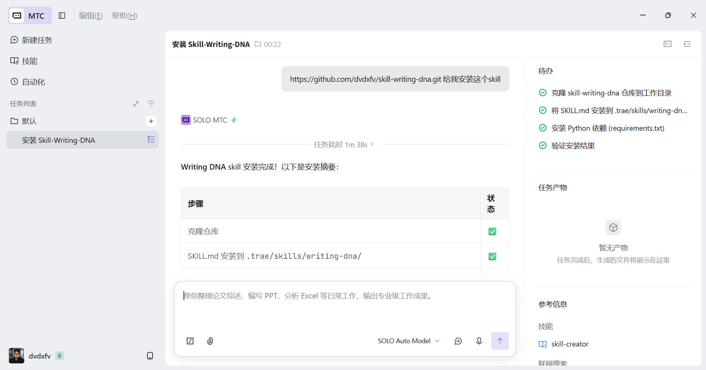
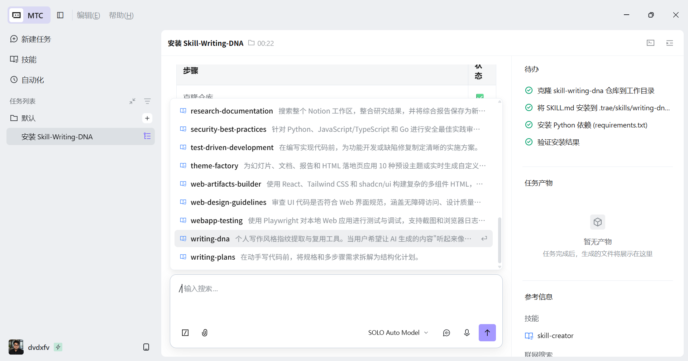
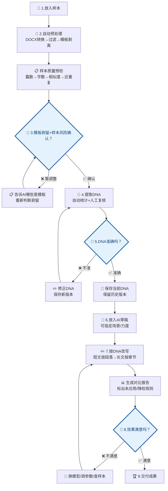
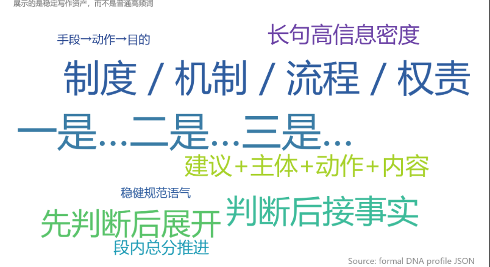
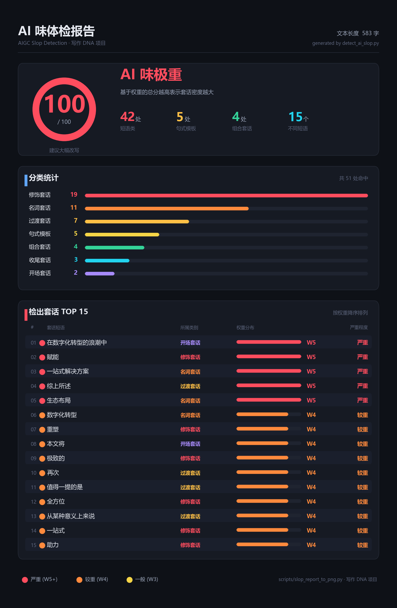
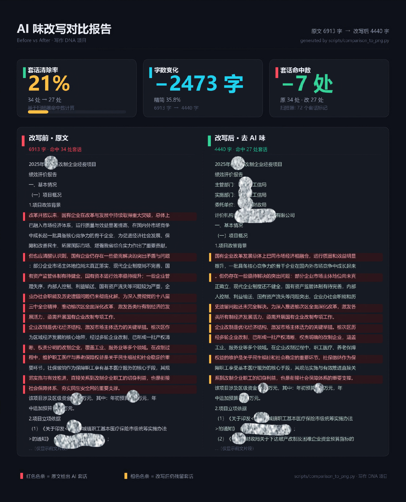
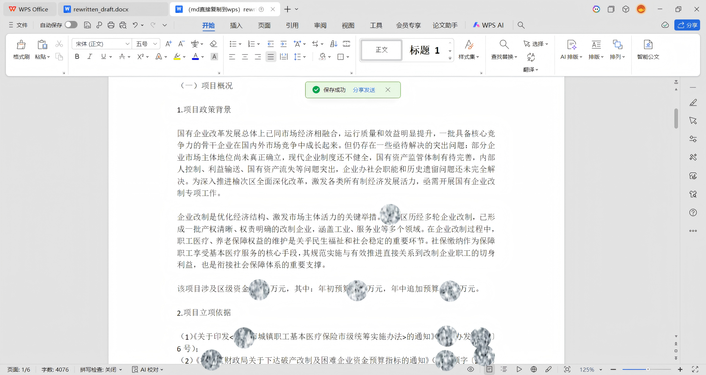
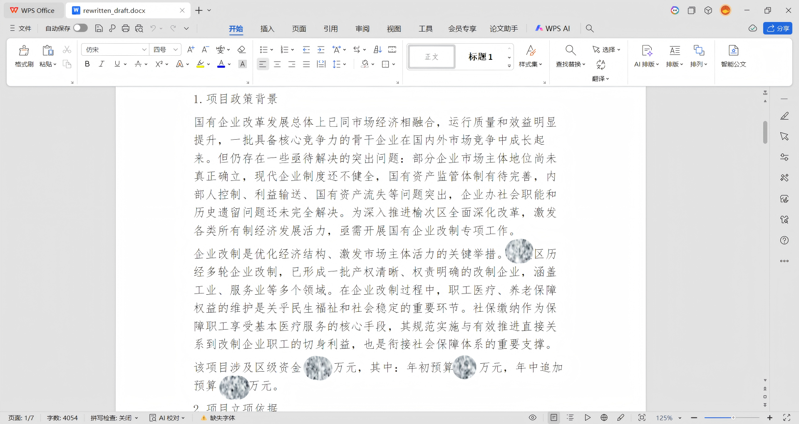

# Writing DNA · 个人写作风格守护者

[English](https://github.com/dvdxfv/skill-writing-dna/blob/main/README_EN.md) | 中文

让 AI 生成的内容"听起来像你写的"。

> 🔌 **怎么用**：Trae / Cursor / Claude Code / VS Code (Copilot) / CodeX 都能用。你只需要在 AI 工具里说：  
> **“帮我安装这个 writing-dna skill：https://github.com/dvdxfv/skill-writing-dna.git。安装后我要能用 `/writing-dna` 调用。”**


*图1 · 告诉 AI 工具安装链接后，它会自动完成克隆仓库、安装依赖，并把 Writing DNA 注册为可用 skill*


*图2 · 安装完成后，「写作 DNA」出现在你的技能列表中，随时可用*

### 给 AI 安装代理看的说明

用户不需要记命令。任何 AI 工具接到“帮我安装这个 skill，并让我能用 `/writing-dna` 调用”的请求时，应自动完成这些事：

1. 克隆或下载本仓库。
2. 安装必要依赖。
3. 按当前工具注册 slash command / skill 入口。
4. 告诉用户重启或重新打开项目窗口。

完整安装清单见 [AI_INSTALL.md](AI_INSTALL.md)。其中的安装器会处理：

| 工具 | 注册位置 | 调用方式 |
|:---|:---|:---|
| Codex | `~/.codex/prompts/writing-dna.md` | `/writing-dna` |
| Claude Code | `~/.claude/commands/writing-dna.md` | `/writing-dna` |
| Cursor | 当前项目 `.cursor/commands/writing-dna.md` | `/writing-dna` |
| Trae / SOLO | `~/.trae/commands/writing-dna.md` + `~/.trae/skills/writing-dna/SKILL.md` + 当前项目 `.trae/commands/` / `.trae/skills/` | 优先尝试 `/writing-dna`；如果当前 Trae 版本不加载第三方 slash command，则退回自然语言自动触发 |

---

## 更新日志

### 2026-05-24

新增：

- 样本质量预检：放入样本后，在第一个确认点一并给出篇数、字数分布、文档相似度、近重复整篇等健康度结论；样本明显不足会提醒并需确认后再继续。
- 写作 DNA 版本管理：修正 DNA 后自动保留历史版本，可随时说"用回上一版"或"跟上一版比比"。
- 英文自然语言触发：支持 `remove AI flavor`、`make it sound like me`、`personal writing style`。
- 长文档分段改写：长文会按章节改，改完统一术语、数字与标题层级。
- 改写可调：可指定发布场景（公众号 / 小红书 / 正式报告等）与改写力度（轻度 / 标准 / 深度）。
- 改写冲突优先级：多目标冲突时按“信息无损 → 黑名单清除 → 签名短语自然使用 → 句长节奏对齐”取舍，避免为了模仿风格牺牲事实完整性。

修复：

- 修复 `run.py extract` / `auto` 提取步骤参数传递错误导致无法运行的问题。
- 修复样本充足性诊断在样本少于 5 篇时崩溃的问题。
- 修复黑名单词硬删、签名短语机械插入导致残句的问题，改为安全替换和语义风险延后处理。
- 修复特征云和报告解释口径：被判定为模板或降权的特征不再重新进入特征云；报告区分“已应用规则”“未应用规则”和“降权参考”。

---

## Skill 解决什么

AI 写稿有两个老大难问题：

1. **AI 套话洗不掉**——"赋能""重塑""在数字化转型的浪潮中"，不管你写什么主题，AI 都要塞这些词
2. **写作味道不对**——句式、节奏、起手收尾的习惯全不是你自己的，读起来就像换了个人

这个 Skill 的思路不是"写一个更聪明的提示词"，而是分三层来解决模板检测问题——这是最核心的架构创新：

| 层级 | 谁做 | 做什么 | 何时 |
|:---|:---|:---|:---|
| 🧹 **Layer 1** | `strip_template.py` 脚本 | 跨文档字面对齐——自动剥离任何文体中反复出现的模板段落，≥60%文档共现的标题/整句/短语直接剥离 | pipeline阶段全自动 |
| 🤖 **Layer 2** | AI 模型（对话中） | 识别文体 + 找语义模板——读 strip_report.md，判断"论文摘要套话""邮件客套话""公众号号召话"等需要再剥一层 | 对话中，AI判断后给建议 |
| 👤 **Layer 3** | 你 | 对 Layer 2 的判断说"剥/留"——论文摘要要不要剥？工作邮件的"此致敬礼"要不要留？ | 对话中，你拍板 |

**关键设计**：Layer 1 完全文体无关——不预设"什么是公文模板"，同一作者不会自我抄袭，所以跨多篇字面重复必定是格式要求。Layer 2 处理 Layer 1 剥不掉的"结构相同但内容不同"的语义模板（如"指标主要考核"这种短句），交给 AI 在对话中判断。Layer 3 必须你拍板——语义级别的东西不能由算法或模型单独决定。

全流程一共 **3 个必停的人工确认点**——模板剥留确认（🔵第3步）、DNA 画像确认（🔵第5步）、改写效果确认（🔵第8步）——因为风格这件事，每一层最后拍板的必须是你。

## 全流程总览

### 一句话流程

```
放样本 → 自动预处理+样本预检 → ⏸️ 确认模板剥留和样本风险 → 提取DNA → ⏸️ 确认DNA并留版本 → 放草稿 → 按场景/力度改写（长文按章节） → ⏸️ 确认效果和未应用规则 → 完成
```

**只有 3 个地方需要你停下来看：**
- 🔵 **模板剥离后（第3步）** — 确认 Layer 2 找出的语义模板要不要剥，同时看样本预检有没有严重风险
- 🔵 **提取完 DNA 后（第5步）** — 确认画像准不准；修正后会自动保留版本
- 🔵 **改写完成后（第8步）** — 确认效果好不好，并查看是否有规则本次没应用

其余全部自动执行。

---

### 完整流程图



> 🔵 **流程图中蓝色菱形 = 必须人工判断的节点，模型不能替你做决定**

### 流程详解

整个过程分三段走，每段跑完都会停下来等你确认。你只需要做三件事：**放样本、确认 DNA、确认改写效果**，其余全自动。

#### 第一段：放样本 → 确认模板剥离（步骤 1 → 3）

把你过去写的文章（5-12篇，`.docx`/`.md`/`.txt` 都行）丢进项目里，然后运行一条命令就能启动。系统会自动完成四件事：把文档转成纯文本、去掉表格图片这类非正文内容、自动识别并剥离所有文章里反复出现的格式套话，同时做一次样本质量预检（篇数、字数分布、文档相似度、近重复整篇）。

做完这些之后，系统会停下来——这是**第一个必停点（🔵第3步）**。

它会给你看一份剥离报告，告诉你"这几处内容我在所有文章里都见到了，判断是格式要求不是你个人风格"。同时 AI 会再帮你检查一遍有没有漏掉的语义模板（比如论文的"摘要引言方法结果"结构、邮件的"此致敬礼"、公众号的"点赞关注转发"之类），并用 2-4 行告诉你样本有没有明显风险，例如样本太少、两篇近重复、某篇太短。

你说"剥"就删、"留"就留。样本有 serious 风险时，AI 会先提醒风险；你确认"知道风险仍要继续"后也可以继续，不会硬拦。拍完板才能进入下一段。

> 模板没确认好，后面提取的 DNA 就不准。所以这一步不能跳。

#### 第二段：提取 DNA → 确认画像（步骤 4 → 5）

模板确认无误后，系统从剥离后的纯净文本里提取你的写作 DNA——包括你最常用的短语、句子的长短习惯、开头结尾的方式、你从来不用的那些套话，还有你的 emoji 用法。全部统计完之后，AI 会结合这些数据画出一份你的"写作特征云"；被你判定为文体模板或不稳定的特征，不会再被画回特征云里误导确认。然后 AI 会**主动停下来等你核对**——这是**第二个必停点（🔵第5步）**。

你需要逐项检查：


*图3 · DNA 特征云：字越大越能代表稳定写作资产，而不是普通词频统计*

| # | AI 给你看什么 | 怎么判断对不对 | 不对劲怎么办 |
|:---:|:---|:---|:---|
| 1 | 最有代表性的写作特征（+ 上方特征云） | 有没有"我从来没说过这个"？少了自己常用的表达？ | 告诉模型"XX 不是我说的，换成 YY" |
| 2 | "你平均每句 XX 字，短句占 XX%" | 跟平时的句子节奏像不像？喜欢长句还是短句？ | 告诉模型"我一般 XX 字一句" |
| 3 | "判定为你从不用的 AI 套话"黑名单 | 有没有把自己的口头禅误杀了？ | 指出误杀项 → 模型帮你从黑名单移除 |
| 4 | "你的文章通常以……开头，以……结尾" | 跟平时起手/收尾方式像不像？ | 复制真实开头/结尾发给模型替换 |

如果整体看着都不像你，别急着往下走。直接在对话里告诉 AI 哪里不对，它就能现场修正：

**常见情况和你该怎么说：**

| 你看到的问题 | 你直接跟 AI 说 | AI 会怎么做 |
|:---|:---|:---|
| "这个特征云里的词我从来不用" | "XX 不是我说的，换成 YY" | 从签名短语里删掉 XX，补上 YY |
| "句长统计跟我的习惯差很远" | "我一般写短句，每句大概 15-20 字" | 调整句长参数到你的真实范围 |
| "黑名单把我的口头禅误杀了" | "XX 是我常用的口头禅，从黑名单移除" | 把 XX 移回白名单，不再清除 |
| "开头结尾模式不对" | "我一般以……开头、以……结尾"（复制一段真实的发过去） | 用你的实际模式替换推断结果 |
| **以上全都不像** | "整体都不对，帮我诊断一下样本够不够" | 跑诊断工具，告诉你缺什么 |

> 💡 **DNA 会自动留版本**：你每次修正后，AI 会存一个新版本，旧版不会丢。以后想退回，直接说"用回上一版"；想看两版改了什么，说"跟上一版比比"。

> DNA 没确认好就改写，等于拿错误的配方做饭。所以这一步不能跳——但也不用怕说错，随时可以改。

#### 第三段：放草稿 → 改写 → 确认效果 → 交付（步骤 6 → 9）

DNA 确认保存后，以后每次拿到一篇 AI 写的草稿（不管哪个工具生成的），丢进来就行。系统会按你的 DNA 自动完成三件事：先把草稿里的 AI 套话清掉，再把你的写作习惯植进去，最后生成一份改写前后的对比报告。

改写前默认按**通用风格 + 标准力度**处理。你也可以直接说"按小红书风改""正式报告一点""改轻点""改狠一点"。如果草稿较长，AI 会先说明"这篇较长，我按章节改"，最后统一检查术语、数字和标题层级。若某些 DNA 规则这次没应用（比如会伤信息完整性），AI 会在确认效果时告诉你，并可展开说明具体是哪几条。

改完后**再次停下来**——这是**第三个也是最后一个必停点（🔵第8步）**。你需要逐项核对：


*图4 · AI 味体检（示例）：实际使用时 AI 会把这套数据直接在对话里展示给你看，不需要去翻文件*

| # | AI 给你看什么 | 怎么判断对不对 | 不对劲怎么办 |
|:---:|:---|:---|:---|
| 1 | "AI 味分数从 X 降到 Y，消除了 Z 个套话"（上方体检报告） | 读一遍改写稿，还有没有"赋能/重塑/综上所述"？ | 指出残留句子 → 针对性重写 |
| 2 | "植入了你的 N 个签名短语：XX、YY……" | 这些短语嵌进去自然吗？像你在说话吗？ | 指出生硬处 → 调整后重跑 |
| 3 | 原文 vs 改写稿并行对比 | 事实、数字、结论都还在吗？有没有遗漏或歪曲？ | 指出丢失信息 → 补回 |
| 4 | 完整的改写稿全文 | 整体能直接发布/提交？还是还得自己改一轮？ | "还需微调" → 指出具体段落 → 定点修改 |


*图5 · 改写前后对比（示例）：实际使用时 AI 会把原稿和改写稿并排展示在对话里，让你逐段对照检查*

如果对改写效果不满意，按这个顺序排查：先回看第二段的 DNA 画像是不是确认得太草率 → 再查样本够不够 → 最后考虑换个 AI 模型试试。

满意的话，你默认会拿到一个 **Markdown 成品文件**（`rewritten_draft.md`），可以直接用。如果需要 Word 版本，在对话里跟 AI 说一句**"转一份 DOCX"**或**"转一下 Word"**就行，它会自动生成带排版的 `.docx` 文件（自动配置黑体标题 + 仿宋正文），打开就能用。

所有可能拿到的文件：

| 文件 | 什么时候有 | 用途 |
|:---|:---:|:---|
| `rewritten_draft.md` | ✅ 默认就有 | 📝 改写后的成品 Markdown |
| `report.md` | ✅ 默认就有 | 📊 改写前后对比报告 |
| `rewritten_draft.docx` | 🔄 你说了才转 | 📄 WPS/Word 排版版 |
| `rewrite_debug.json` | ✅ 默认就有 | 🔧 详细指标数据（一般不用管） |

*图6 · MD 乱码 vs DOCX 转换：左边 Markdown 直接粘贴到 WPS 不可读，右边自动转出的排版文档整洁如初*

| MD 直接粘贴到 WPS | DOCX 转换后 |
|:---:|:---:|
|  |  |

> 改写没确认就交付，等于没做过风格化。三个确认点，一个都不能省。

---

## 效果不好怎么办？

DNA 画像不准？改写后不像你写的？**按顺序排查，不要盲目加样本或换模型。**

---

### 排查总览

```
问题出现
   ↓
① 跑样本充足性测试 ──→ 样本不够？ ──→ 补样本（不同类型）→ 重新提取
   ↓ 够
② 跑模板画像检查 ──→ 剥离有问题？ ──→ 调 strip_template 规则 → 重新剥离+提取
   ↓ 没问题
③ 检查 DNA 规则 ──→ 规则不对？ ──→ 手动调整 DNA JSON → 重新改写
   ↓ 没问题
④ 换模型 / 调参数 ──→ 重跑改写
```

---

<a id="样本充足性测试"></a>

### ① 样本充足性测试（多维预检）

> 📖 **延伸阅读**：样本数量与类型的详细建议，见下方 [关于样本](#关于样本) 章节。

**症状：** DNA 提取的特征很少、很泛，或者你觉得"这不像我"

这一步现在是**多维预检**（文体无关，公文 / 小红书 / 博客 / 邮件都适用）。`run.py pipeline`
在模板剥离后会**自动跑一次**，并把结论**并入第一个确认点**（模板剥留确认）告诉你——不必单独运行；排查时也可手动跑：

```bash
python scripts/test_sample_sufficiency.py
```

报告输出到 `outputs/debug/sample_sufficiency_test.md`，覆盖这几维：

| 维度 | 看什么 |
|:---|:---|
| **数量** | 篇数够不够（建议 5-12 篇）|
| **字数分布** | 有没有过短样本（< 800 字）、单篇是否过度主导 DNA |
| **文档间相似度** | 几篇是不是太像（类型单一会让领域噪声冒充个人风格）|
| **近重复整篇** | 有没有把同一篇的初稿 / 定稿都放进来（变相减少样本）|
| **留一法 + 饱和度** | 特征排序稳不稳、再加样本还有没有收益 |

报告顶部给一个**分级结论**：

- **✅ ok** → 样本健康，直接提取
- **⚠️ light**（接近下限 / 略不均 / 类型偏单一）→ 提示，但可继续
- **❌ serious**（篇数 < 5 / 高度同质 / 多数近重复）→ 会提醒你，确认"知道风险仍要继续"后才往下；想补就补 **2-3 篇不同类型**的文档再 `run.py extract`

> 想看每篇字数、哪两篇重复这些明细，在对话里说一声"展开"即可。

---

### ② 模板剥离检查

**症状：** DNA 里混入大量套话/格式化内容，或者提取出的特征太少

模板剥离脚本 `scripts/strip_template.py` 在 `run.py pipeline` 时已自动跑过一次，并生成了 `outputs/template_profiles/strip_report.md`。打开它检查：

```bash
# 如想换阈值重跑（默认 60%）：
python scripts/strip_template.py --input inputs/filtered_markdown --output-dir inputs/template_stripped_markdown --doc-ratio-threshold 0.6 --report outputs/template_profiles/strip_report.md
```

查看 `strip_report.md` 中的三段（重复章节标题 / 字面整句重复 / ≥8 字高频长短语）：

| 现象 | 含义 | 怎么办 |
|:---|:---|:---|
| 报告把你的**个人风格短语**也当成模板剥了 | 阈值太宽 → 误杀 | 把 `--doc-ratio-threshold` 调高（如 `0.8` 表示需要 8/10 篇都出现才算模板） |
| 报告漏了明显模板（每篇都有但没抓到） | 阈值太严或 ngram 起点太长 | 调低阈值（如 `0.5`）或缩短 `--min-ngram` |
| 报告基本对，但还有"结构相同但内容不同"的模板留下 | Layer 1 处理不了语义模板（这是设计预期） | 这是 Layer 2 的工作——由 LLM 在对话里识别并和你确认（见 [SKILL.md](SKILL.md) Step 1.5b/c） |

> 💡 PRD §8.1.3 把模板剥离设计为三层：Layer 1 是这个脚本做的"跨文档字面对齐"；Layer 2 是 LLM 在对话里做的"语义模板识别"；Layer 3 是你确认。脚本只负责前者，不要期待它识别所有文体的语义模板。

---

### ③ DNA 规则检查

**症状：** 样本和模板都没问题，但改写后的文章还是不像你的风格

打开 `outputs/dna_profiles/<你的名字>-dna.json`，逐条检查：

| 检查项 | 问题表现 | 调整方式 |
|:---|:---|:---|
| **句长分布** | 改写后句子忽长忽短 | 检查 `sentence_length` 区间是否与原文匹配 |
| **连接词偏好** | 出现你不常用的连接词 | 检查 `connectors` 黑名单/白名单是否完整 |
| **签名短语** | 没有植入或植入位置生硬 | 检查 `signature_phrases` 是否有足够的示例句 |
| **制度词/高频词** | 用词风格偏差大 | 检查 `vocabulary_preferences` 词表是否准确 |

手动编辑 DNA JSON 后，重新运行：

```bash
python run.py rewrite
```

---

### ④ 模型与参数调优

> 📖 **延伸阅读**：不同模型在改写任务上的表现差异很大，详见下方 [关于模型](#关于模型) 的跨模型 Benchmark 实测结果。

**症状：** 以上三步都确认没问题，但改写质量仍不满意

按以下优先级尝试：

1. **换模型** — 不同模型对改写规则的遵循度差异很大：
   - Claude：规则遵循最严格
   - ChatGPT：信息保留最好
   - DeepSeek：性价比最高

2. **调参数** — 编辑 `config.yaml`：
   - `rewrite_aggressiveness`: 降低 = 更保守（更像原文），提高 = 更激进（更像你的风格）
   - `signature_density`: 签名短语植入密度

3. **检查输入稿** — 确保 AI 草稿本身信息完整，没有缺失段落

---

### 快速定位对照表

| 你遇到的问题 | 最可能的原因 | 先跑哪个测试 |
|:---|:---|:---|
| DNA 特征很少、很空泛 | 样本量不够 或 类型太单一 | ① 样本充足性测试 |
| DNA 里有很多套话/格式语 | 模板没剥干净 | ② 模板画像检查 |
| DNA 提取了但改写后不像 | DNA 规则需要微调 | ③ DNA 规则检查 |
| 改写后信息丢失严重 | 模型太激进 | ④ 换保守模型 |
| 改写后风格变化太小 | 模型太保守 或 参数太低 | ④ 提高激进度/换模型 |

---

<a id="关于样本"></a>

## 关于样本

### 样本数量建议

| 篇数 | 效果 | 总字数参考 |
|:---:|:---|:---:|
| 1-4 篇 | ❌ 不够——无法区分单篇特点和稳定习惯 | < 1.7 万字 |
| **5 篇** | ⚠️ 下限——稳定特征刚好浮现，但不确定项偏多 | 约 2 万字 |
| **8 篇** | ✅ 最佳——不确定项收敛，特征基本确认 | 约 3.5 万字 |
| **12 篇** | ✅ 上限——特征饱和，再加边际收益极低 | 约 5 万字 |

> 💡 **不确定自己样本够不够？直接跑一下测试：**
> ```bash
> python scripts/test_sample_sufficiency.py
> ```
> 报告会告诉你留一法波动值和饱和度曲线结论（详见下方"效果不好怎么办"）。

---

### 样本类型多样性（重要！）

**类型多样比数量堆叠更重要。**

如果你只交同一类文章，DNA 会混入大量行业模板/固定格式，导致个人风格被淹没。

#### ✅ 好的样本组合

| 样本类型 | 提取什么 |
|:---|:---|
| 分析论证类（如报告、评估、调研） | 论证结构、制度词使用习惯、数据引用方式 |
| 总结规划类（如工作总结、方案建议） | 段落组织方式、总结句式、条目化表达 |
| 公开表达类（如文章、评论、演讲稿） | 表达灵活性、修辞偏好、语气变化 |
| 申请说服类（如申报书、请示函） | 说服性写作手法、措辞分寸感 |

**核心原则：让 DNA 提取器看到你在不同场合下的写作习惯，才能区分"你的风格"和"行业模板"。**

#### ❌ 不好的样本组合

```
❌ 同一类型 × N 篇       → DNA = 行业模板，不是你
❌ 同一项目初稿+终稿     → 内容高度重复，等于只有1篇
❌ 全是合署作品         → 混入第二作者风格
❌ 全是复制粘贴的模板   → 提取不到任何个人特征
```

#### 实际操作建议

- 覆盖 **3 种以上** 不同写作类型
- 来自 **不同场景或受众**
- 尽量使用 **独著** 作品
- 如果实在只有一种类型，至少确保 **时间跨度 > 半年**（体现风格演变）

### 文件格式支持

| 格式 | 支持方式 |
|:---|:---|
| `.docx` | 自动转换（内置 DOCX→Markdown 链路） |
| `.md` / `.txt` | 直接读取 |
| 粘贴文本 | 用 `---` 分隔多篇 |
| 文件夹 | 自动扫描所有 `.docx` / `.md` / `.txt` |

---

<a id="关于模型"></a>

## 关于模型

### DNA 提取阶段

DNA 提取主要依赖**人工分析 + 跨文档对比**，与使用哪个大模型关系不大。自动统计脚本（`scripts/test_sample_sufficiency.py`、`scripts/extract_dna.py`）辅助判断，但不替代人工判断。

### DNA 改写阶段

改写阶段对不同模型的敏感度较高。以下为跨模型 Benchmark 实测结果：

#### 已测试模型

| 模型 | 适合程度 | 综合评分 | 评审模型 | DNA遵循度 | AI味清除 | 信息完整性 | 风格相似度 | 改写策略 |
|:---|:---:|:---:|:---|:---:|:---:|:---:|:---:|:---|
| **Claude Opus** | ⭐⭐⭐⭐ | 8.5 / 10 | DeepSeek V4 Pro | ⭐9.0 | 8.0 | ⭐9.0 | 8.5 | 结构转化 |
| **ChatGPT 5.5** | ⭐⭐⭐⭐ | 8.3 / 10 | DeepSeek V4 Pro | 8.5 | 8.5 | ⭐9.0 | 8.0 | 均衡转化 |
| **DeepSeek V4 Pro** | ⭐⭐⭐⭐ | 8.0 / 10 | ChatGPT 5.5 | 8.0 | 7.5 | 8.5 | 8.0 | 主动压缩 |
| **GLM 5V Turbo** | ⭐⭐ | 6.5 / 10 | DeepSeek V4 Pro | 6.5 | 6.0 | ⭐9.5 | 5.5 | 极度保守 |
| **Kimi K2.6** | ⭐⭐ | 6.5 / 10 | DeepSeek V4 Pro | 6.5 | 6.0 | ⭐9.5 | 5.5 | 极度保守 |
| **千问 3.6 Plus** | ⭐⭐ | 6.5 / 10 | DeepSeek V4 Pro | 6.5 | 6.0 | ⭐9.5 | 5.5 | 极度保守 |
| **千问 3.5 Plus** | ⭐⭐ | 6.5 / 10 | DeepSeek V4 Pro | 6.5 | 6.0 | ⭐9.5 | 5.5 | 极度保守 |

> 当前最佳为 Claude Opus（8.5），首次在"白话语段→枚举式结构"层面做出实质性格式转换。ChatGPT 5.5（8.3）和 DeepSeek V4 Pro（8.0）分别在均衡性和压缩力度上各有优势。三者均明显优于四款保守模型（6.5）。

#### Claude Opus 详细评审

> **评审模型**：DeepSeek V4 Pro · **评审时间**：2026-05-17 · **改写稿**：直接提交全文（用户粘贴），未单独落盘

Claude Opus 在此次改写中采用了与前六个模型完全不同的策略——"结构转化"。它不是在做同义替换或段落压缩，而是在 **将白话叙述改写为枚举式结构**，这是 DNA 规则 2 和规则 3 的核心要求，此前没有任何模型做到这个层面：

- **DNA 规则遵循度 9.0**：Claude 是首个在"白话语段→枚举结构"层面做转化的模型。三个关键点位：项目实施流程从长句"依据…填写…经…交由…"转为"一是…二是…三是…四是…"；主要绩效从散句"按照收支两条线原则…全年累计保障…按月缴纳…"转为枚举式总结；经验做法从时间线叙述转为"按'人员推送—费用核算—缴费推送—资金保障'流程链：一是…二是…三是…四是…"。这直接命中了 DNA 画像核心特征——"偏好枚举式过渡"
- **AI 味清除 8.0**：政策背景段做了压缩但保留了国企改革的必要语境，"亟需"等词仍带轻微模板味；整体干净，未发现典型 AI 黑名单词
- **信息完整性 9.0**：1518 万元、6782 人次、90.14 分、12 家企业、政策文号、指标得分、满意度分项全部保留
- **风格相似度 8.5**：枚举式结构的转换使输出在"结构习惯"层面而非仅"用词"层面接近 DNA 画像；"产权相对清晰、权责相对分明"中"相对"的加入体现了制度分析者的审慎语气——这与 DNA 画像中"避免过高承诺/不用极致副词"的要求一致
- **改写创新性 8.5**：不是同义替换，不是段落压缩，而是 **结构性调整**——识别出哪些段落适合转化为枚举式表达并实际执行了转换

**结论**：Claude Opus（8.5）是当前表现最好的模型，关键差异在于它触及了"格式层面"的改写——将白话语段转化为 DNA 指定的枚举式结构，而非停留在用词替换层面。这是此前五个模型（包括 ChatGPT 5.5 和 DeepSeek V4 Pro）都没有做到的。

**限制**：输出文本末尾在"三是榆…"处截断，未看到建议章节的完整输出，以上评估基于已收到的 3000+ 字改写内容。

#### ChatGPT 5.5 详细评审

> **评审模型**：DeepSeek V4 Pro · **评审时间**：2026-05-17 · **改写稿**：`outputs/model_benchmarks/chatgpt_5_5_rewritten.md` · **AI 味检测**：`outputs/model_benchmarks/chatgpt_5_5_slop_report.json`（得分 1/100，原始输入为 2/100）

ChatGPT 5.5 在此次改写中采用"均衡转化"策略——在风格转化和信息保留之间找到了比 DeepSeek V4 Pro 更好的平衡点：

- **DNA 规则遵循度 8.5**：段首判断句落实到位（如"项目支出内容围绕改制企业职工保障开展""项目支付流程已形成基本闭环""绩效管理水平仍显不足"），建议部分严格遵循"建议+主体+动作+内容"句式，问题分析使用"一是…二是…三是…"枚举；基础章节的风格转化略弱于问题/建议章节，但整体遵循度高于 DeepSeek V4 Pro
- **AI 味清除 8.5**：AI 套话检测仅 1/100（原始输入 2/100），命中的 11 条全部为政策文件固定表述（如"全面实施预算绩效管理"）或中性公文用语（"再次""构建""深入"），均不是典型 AI 水词；"赋能/重塑/生态/一站式/综上所述"等硬性黑名单词未出现
- **信息完整性 9.0**：1518 万元、6782 人次、90.14 分、12 家企业、各项指标得分、满意度分项、政策文号、评价依据清单全部完整保留；评价工作过程和阶段性目标等细节也被保留，未出现 DeepSeek V4 Pro 的过度压缩问题
- **风格相似度 8.0**：问题分析段（"一是…二是…三是…"每项附事实、因果隐含在事实中）和建议段（建制式措辞、先方向后方案）最接近 DNA 画像；政策背景段虽做了缩减但仍有"发挥了重要作用""具有较强的民生属性"等偏通用公文表达
- **改写创新性 7.5**：主要是重组句式、压缩冗余、强化判断句，而非大幅重构段落结构；改写策略偏稳健，优点是可读性强、无需大量人工补回，缺点是风格突破幅度不如 DeepSeek V4 Pro 激进

**结论**：ChatGPT 5.5 是当前已测模型中综合表现最好的版本（8.3），在"像本人写的"和"信息不丢"之间取得了最实用的平衡。适合作为主改写模型直接使用，人工复核量低于 DeepSeek V4 Pro。如需更激进风格突破仍可选用 DeepSeek V4 Pro，代价是更高的信息补回成本。

#### DeepSeek V4 Pro 详细评审

> **评审模型**：ChatGPT 5.5 · **评审时间**：2026-05-17 · **输入文件**：`outputs/dna_profiles/user_dna_profile.md` + `outputs/rewrite_runs/new_ai_draft_effective_input.md` · **详细记录**：`outputs/reports/deepseek_v4_pro_review_chatgpt55.md`

DeepSeek V4 Pro 在此次改写任务中明显区别于前四个保守模型，属于"主动压缩 + 风格转化"路线：

- **DNA 规则遵循度 8.0**：能落实段首判断、并列展开、制度化建议和规范语气，问题与建议部分最接近 DNA 要求；但基础情况、评价过程等模板性章节仍保留较多原文组织方式
- **AI 味清除 7.5**：删除或压缩了部分宏大背景、重复政策语和空泛修饰，整体更紧凑；但"优化经济结构、激发市场主体活力""兜牢民生底线"等通用公文表达仍有残留
- **信息完整性 8.5**：1518 万元、6782 人次、90.14 分、12 家企业、各项指标得分等核心事实保留完整；但评价依据、工作过程、部分满意度分项和阶段性目标细节被压缩，存在轻微信息损耗
- **风格相似度 8.0**：相比原稿更强调"判断句 + 事实支撑 + 建制建议"，问题分析和政策建议段落较符合用户 DNA；不足是部分章节为了精简而弱化了报告体例的完整展开
- **改写创新性 8.0**：不只是同义替换，而是主动调整段落密度、删除模板噪声、重组问题与建议表达；需要人工复核信息边界后再作为定稿使用

**结论**：DeepSeek V4 Pro 是当前已测模型中首个真正产生风格转化的版本，适合作为"第二轮风格主改写"使用。最佳用法是先用保守模型校验信息完整性，再用 DeepSeek V4 Pro 做风格压缩，最后人工补回被压缩过度的依据、过程和分项数据。

#### 保守模型共同结论

以下四个模型表现高度一致，均以信息安全为优先，适合作为事实保真校验，不适合作为主改写模型。

#### 千问 3.6 Plus 详细评审

> **评审模型**：DeepSeek V4 Pro · **评审时间**：2026-05-17 · **输入文件**：`outputs/dna_profiles/user_dna_profile.md` + `outputs/rewrite_runs/new_ai_draft_effective_input.md`

千问 3.6 Plus 与千问 3.5 Plus 在此次改写任务上的表现无实质差异，各项得分完全相同：

- **DNA 规则遵循度 6.5**：8 条规则形式上均被遵守，但改写后与原文差异极小，未展现 DNA 驱动的风格转化
- **AI 味清除 6.0**：原文为政府公文，AI 套话基准含量低，实际清理幅度有限
- **信息完整性 9.5**：全部关键数据（1518 万、6782 人、90.14 分）、政策文号、企业名称、指标得分完整保留，无丢失
- **风格相似度 5.5**：改写后与原文高度相似——核心问题是输入稿与 DNA 来源样本属于同一文类，模型倾向于"不动比动好"
- **改写创新性 4.0**：整体偏向微调而非改写，缺乏风格驱动的主动转化

**结论**：千问系列（3.5/3.6）在公文类改写任务上均展现出"极度保守"特性——信息保真度极高但风格转变零提升。版本升级未改变这一倾向。建议作为"第一轮安全校验"使用，核心改写任务交给改写策略更激进的模型。

#### 千问 3.5 Plus 详细评审

> **评审模型**：DeepSeek V4 Pro · **评审时间**：2026-05-17 · 得分与 3.6 Plus 完全一致，详见上方 3.6 Plus 评测，此处不再重复展开。

#### Benchmarks 总结

共测试 **7 个模型**，评测结果按策略类型分为三个梯队：

| 梯队 | 模型 | 评分 | 策略 | 定位 |
|:---:|:---|:---:|:---|:---|
| 🥇 | **Claude Opus** | **8.5** | 结构转化 | 主改写——格式层面改写，白话语段→枚举结构 |
| 🥈 | **ChatGPT 5.5** | 8.3 | 均衡转化 | 主改写——风格与信息保留最平衡 |
| 🥉 | **DeepSeek V4 Pro** | 8.0 | 主动压缩 | 次改写——风格突破最大胆，需人工补回 |
| — | GLM 5V Turbo | 6.5 | 极度保守 | 安全校验——信息零丢失，风格零转化 |
| — | Kimi K2.6 | 6.5 | 极度保守 | 安全校验——同上 |
| — | 千问 3.6 Plus | 6.5 | 极度保守 | 安全校验——同上 |
| — | 千问 3.5 Plus | 6.5 | 极度保守 | 安全校验——同上 |

**核心发现：**

1. **信息安全和风格转化是互斥需求**——没有模型能在两个维度同时拿到 9.0+
2. **改写存在三个层次**：用词替换（所有保守模型）→ 段落重组（DS V4 Pro、ChatGPT 5.5）→ 格式结构转化（Claude Opus）
3. **同一文类输入是评测的关键变量**：原文与 DNA 来源样本同属公文类时，模型倾向于"不动比动好"，这是保守模型集体 6.5 分的根本原因
4. **AI 味检测工具的参考价值有限**：原文已含公文模板语（非典型 AI 水词），检测分数模型间差异不显著（1-2/100）

#### 模型选型建议

| 场景 | 推荐模型 | 原因 |
|:---|:---|:---|
| 日常改写，直接可用 | **ChatGPT 5.5** | 均衡性最好，人工复核量最小 |
| 追求最大风格突破 | **Claude Opus** | 唯一做格式层改写，DNA 遵循度最高 |
| 预算敏感/大批量 | **DeepSeek V4 Pro** | 性价比最优，激进压缩可配合人工补回 |
| 事实保真校验 | 千问/Kimi/GLM | 信息零丢失，适合做第一轮安全校验 |

> 每个模型的评分由**另一独立模型**交叉评审完成，确保评分客观。完整 Benchmark 设计及过程记录见 `PROJECT_STATUS.md`。

---

## 能力边界

这个工具改的是**"怎么写"**，不改**"写了什么结构"**。以下限制请提前了解，避免不切实际的期望：

### 不能做的事

| 限制 | 原因 |
|:---|:---|
| **不能跨标题改写全文结构** | 改写以段落/标题段为单元，不会移动或重组章节顺序 |
| **不能还原原始 DOCX 排版** | DOCX→MD 转换丢失字体、字号、页边距。最终 DOCX 使用默认中文排版模板 |
| **不能 100% 保证标题层级识别准确** | 原文若未使用 WPS/Word 大纲样式，标题识别依赖文本特征推断 |
| **不能处理图片、图表、附件** | 文本清洗阶段已移除 |

### 交付格式

满意确认后，交付两份文件：

| 格式 | 适用场景 |
|:---|:---|
| `.md` | 纯文本阅读、版本控制、二次编辑 |
| `.docx` | WPS / Word 直接打开查看排版效果 |

DOCX 由 `scripts/md_to_docx.py` 生成（依赖 pandoc），自动配置黑体标题 + 仿宋正文，WPS 打开不乱码。

---

## 仓库结构

```
writing-dna/
├── .claude/                            # Claude Code 注册入口
│   ├── commands/
│   │   └── writing-dna.md              # slash command 定义
│   └── writing-dna.md                  # skill 入口
├── .codex/                             # CodeX 注册入口
│   ├── prompts/
│   │   └── writing-dna.md              # prompt 定义
│   └── rules/
│       └── writing-dna.md              # 规则定义
├── .cursor/                            # Cursor 注册入口
│   ├── commands/
│   │   └── writing-dna.md              # slash command 定义
│   └── rules/
│       └── writing-dna.md              # 规则定义
├── .github/
│   └── copilot-instructions.md         # GitHub Copilot 指令
├── .trae/                              # Trae / SOLO 注册入口
│   ├── commands/
│   │   └── writing-dna.md              # slash command 定义
│   └── skills/
│       └── writing-dna/
│           └── SKILL.md                # skill 完整流程定义
├── docs/                               # 文档与图片资源
│   ├── images/                         # README 配图
│   │   ├── 3cea31070b1b8d378f728da10cf6b9b8.png  # 安装过程截图
│   │   ├── ai_slop_report.png          # AI 味体检报告
│   │   ├── c26597bc7d57f17b0fa6de7d76f8e9dc.png  # 安装完成截图
│   │   ├── comparison_report.png       # 改写前后对比
│   │   ├── md_raw_wps_garbled.png      # MD 粘贴到 WPS 乱码
│   │   ├── model_benchmark_example.png # 模型评测示例
│   │   ├── user_dna_hotwords_example.png # DNA 特征云
│   │   └── wps_docx_effect.png         # DOCX 排版效果
│   ├── writing-dna-architecture.md     # 系统架构说明
│   └── writing-dna-module-map.md       # 模块关系图
├── examples/                           # 改写示例（输入输出对照）
│   ├── 01-chatgpt-xiashentan.md        # ChatGPT 改写：瞎神探
│   ├── 02-notion-ai-zhibuzhi.md        # Notion AI 改写：知不知
│   ├── 03-cursor-diqitian.md           # Cursor 改写：第七天
│   ├── 04-obsidian-xiezai.md           # Obsidian 改写：写在
│   ├── 05-ai-pm-bietuile.md            # AI PM 改写：别推了
│   └── ai_slop_input.md                # AI 味检测输入示例
├── inputs/                             # 用户样本存放（运行时目录）
│   ├── README.md                       # 使用说明
│   ├── filtered_markdown/              # 过滤后的纯文本
│   ├── normalized_markdown/            # 标准化后的文本
│   └── template_stripped_markdown/     # 剥离模板后的文本
├── outputs/                            # 运行输出（运行时目录）
│   ├── README.md                       # 使用说明
│   ├── debug/                          # 调试诊断报告
│   ├── dna_profiles/                   # DNA 画像文件
│   └── rewrite_runs/                   # 改写运行结果
├── scripts/                            # 核心脚本
│   ├── ai_slop_dict.py                 # AI 套话黑名单词典
│   ├── detect_ai_slop.py               # AI 味检测
│   ├── docx_to_md.py                   # DOCX → Markdown 转换
│   ├── extract_dna.py                  # DNA 特征提取
│   ├── filter_non_prose.py             # 非正文内容过滤
│   ├── generate_report.py              # 改写对比报告生成
│   ├── install_ai_tool_commands.py     # 多工具自动安装器
│   ├── md_to_docx.py                   # Markdown → DOCX 转换
│   ├── render_dna_feature_cloud.py     # DNA 特征云渲染
│   ├── rewrite_with_dna.py             # 按 DNA 画像改写
│   ├── strip_template.py               # Layer1 模板剥离
│   └── test_sample_sufficiency.py      # 样本充足性诊断
├── AI_INSTALL.md                       # AI 工具安装清单
├── CLAUDE.md                           # Claude Code 项目规则
├── README.md                           # 项目说明（本文件）
├── README_EN.md                        # 英文说明
├── SKILL.md                            # Skill 完整流程定义
├── WRITING_DNA.md                      # 跨平台通用指令
├── config.yaml                         # 运行参数配置
├── requirements.txt                    # Python 依赖清单
└── run.py                              # 全流程一键入口
```

> **关于测试目录**：自动化测试套件在本地 `tests/`（pytest，用于开发期回归与验收）。该目录已在 `.gitignore` 中整体排除，**不随仓库上传 GitHub**，所以上面的结构树里没有它——克隆后看不到 `tests/` 属于预期。

---
