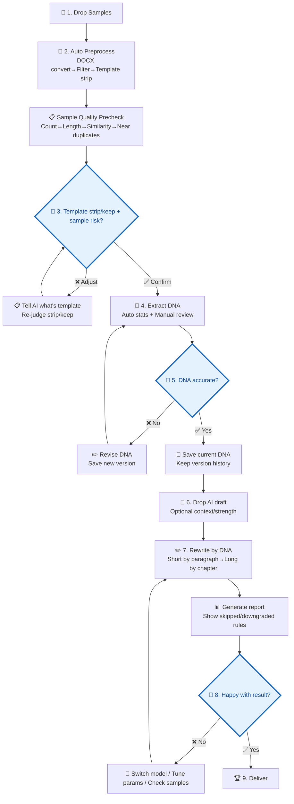

# Writing DNA · Your Personal Writing Style Guardian

[中文](https://github.com/dvdxfv/skill-writing-dna) | English

Make AI-generated content sound like **you** wrote it.

> 🔌 **How to use**: Works on Trae / Cursor / Claude Code / VS Code (Copilot) / CodeX. Just tell your AI tool:  
> **"Install this writing-dna skill for me: https://github.com/dvdxfv/skill-writing-dna.git. After installation, I want to call it with `/writing-dna`."**
>
> **Natural-language triggers**: you can also just say *"remove AI flavor"*, *"make it sound like me"*, or *"personal writing style"* — the skill auto-activates on these (same as the Chinese triggers).


*Fig 1 · After giving the AI the install link, it auto-completes cloning, dependency installation, and registers Writing DNA as an available skill*


*Fig 2 · Once installed, "Writing DNA" appears in your skill list, ready to use anytime*

### For AI Install Agents

Users should not need to remember commands. When an AI tool receives a request like "install this skill and make `/writing-dna` available", it should automatically:

1. Clone or download this repository.
2. Install required dependencies.
3. Register the slash command / skill entrypoint for the current tool.
4. Tell the user to restart the tool or reopen the project window.

See [AI_INSTALL.md](AI_INSTALL.md) for the full install checklist. Its installer handles:

| Tool | Registration path | Invocation |
|:---|:---|:---|
| Codex | `~/.codex/prompts/writing-dna.md` | `/writing-dna` |
| Claude Code | `~/.claude/commands/writing-dna.md` | `/writing-dna` |
| Cursor | Current project `.cursor/commands/writing-dna.md` | `/writing-dna` |
| Trae / SOLO | `~/.trae/commands/writing-dna.md` plus `~/.trae/skills/writing-dna/SKILL.md`, and project `.trae/commands/` / `.trae/skills/` | Try `/writing-dna` first; if the current Trae build does not load third-party slash commands, fall back to natural-language Skill auto-trigger |

---

## Changelog

### 2026-06-08

Added:

- Post-rewrite DNA alignment validation: reports sentence-length deviation, signature-expression matches, blacklist residuals, AI-slop residuals, opener-pattern fit, and not-applied / downgraded rules for the third checkpoint.
- Public minimal test suite: sanitized pytest coverage for sample precheck, DNA versioning, rewrite safety, report wording, and the validation script.
- Tool-entrypoint sync check: verifies Trae / Cursor / Claude Code / VS Code / Codex entrypoints keep critical instructions aligned, reducing multi-copy maintenance risk.

Changed:

- Signature expressions are no longer described as mechanical insertion; the wording is now natural matches, candidate suggestions, and second-pass rewrite guidance.
- Boundary clarified: Writing DNA is not a pure-script semantic rewriter. High-quality rewriting still depends on the current AI model; scripts provide detection, constraints, validation, reporting, and safety assistance.

### 2026-05-24

Added:

- Sample quality precheck: the first checkpoint now includes sample health across count, length distribution, document similarity, and near-duplicate drafts; serious issues require explicit confirmation before continuing.
- Writing DNA versioning: revised DNA profiles keep history, so you can say "roll back to the previous version" or "compare with the previous version."
- English natural-language triggers: `remove AI flavor`, `make it sound like me`, and `personal writing style`.
- Long-document rewriting: long drafts are rewritten by chapter, then checked for terminology, numbers, and heading consistency.
- Adjustable rewrite context: specify publication context and rewrite strength, such as social post, formal report, lighter edit, or deeper rewrite.
- Rewrite conflict priority: when goals conflict, the order is information preservation → blacklist removal → natural signature-phrase use → sentence rhythm alignment, so style imitation does not override factual integrity.

Fixed:

- Fixed `run.py extract` / `auto` failing because the extraction command did not pass `--input`.
- Fixed sample sufficiency diagnostics crashing when fewer than 5 samples were provided.
- Fixed unsafe hard deletion of blacklisted phrases and mechanical signature insertion that could produce broken sentences; risky edits are now replaced safely or deferred for semantic rewriting.
- Fixed feature-cloud and report wording: features marked as template artifacts or downgraded no longer reappear in the cloud; reports separate applied rules, not-applied rules, and downgraded references.

---

## What This Skill Solves

AI-generated writing has two stubborn problems:

1. **AI clichés won't go away** — "leverage," "empower," "ecosystem," "in the wave of digital transformation." No matter your topic, AI insists on padding it with these phrases
2. **The voice is wrong** — sentence rhythm, paragraph flow, opening and closing habits are not yours. It reads like someone else wrote it

This Skill's approach isn't "write a smarter prompt." It solves the template detection problem in three layers — the core architectural innovation:

| Layer | Who | What | When |
|:---|:---|:---|:---|
| 🧹 **Layer 1** | `strip_template.py` script | Cross-document literal alignment — auto-strips template passages recurring in ≥60% of docs (headings / full sentences / ≥8-char phrases) | Pipeline stage, fully automatic |
| 🤖 **Layer 2** | AI model (in conversation) | Identifies text genre + finds semantic templates — reads strip_report.md, flags "abstract boilerplate" "email pleasantries" "social media CTAs" etc. that need another stripping pass | In conversation, AI gives recommendations |
| 👤 **Layer 3** | You | Say "strip" or "keep" on Layer 2's findings — should thesis abstracts be stripped? Should "Best regards" in work emails be kept? | In conversation, you decide |

**Key design**: Layer 1 is completely genre-agnostic — no presets for "what a bureaucratic template looks like." An author doesn't self-plagiarize, so cross-document literal repetition must be format requirements. Layer 2 handles the "structurally identical but semantically different" templates Layer 1 can't catch (short phrases like "indicators mainly assess"), delegating judgment to the AI. Layer 3 requires your sign-off — semantic-level decisions cannot be made by algorithms or models alone.

The full pipeline has **3 mandatory human checkpoints** — template strip/keep confirmation (🔵 Step 3), DNA profile accuracy (🔵 Step 5), and rewrite quality (🔵 Step 8) — because at every layer, the final call must be yours.

## Workflow Overview

### One-Liner

```
Drop samples → Auto preprocess + sample precheck → ⏸️ Confirm template strip/keep and sample risk → Extract DNA → ⏸️ Confirm DNA with version history → Drop draft → Rewrite by context/strength (long drafts by chapter) → ⏸️ Confirm result and skipped rules → Done
```

**Only 3 points require your attention:**
- 🔵 **After template stripping** — Confirm Layer 2's semantic template findings and any sample-quality risk
- 🔵 **After DNA extraction** — Verify the profile is accurate; revisions are versioned automatically
- 🔵 **After rewriting** — Confirm the result and see whether any rules were skipped or downgraded

Everything else runs automatically.

---

### Full Flowchart



> 🔵 **Blue diamonds = mandatory human judgment points. The model cannot decide for you.**


*Fig 3 · AI Slop Detection: higher score = stronger AI-flavor, details show which clichés were hit*

### 🔵 Step 4: Is the DNA Accurate? — 4 Items You Must Check

After extracting DNA, the model **stops and waits for your confirmation**. It displays everything directly in the conversation — no need to dig through files:

| # | What you'll see | How to judge | What to do if wrong |
|:---:|:---|:---|:---|
| 1 | Your strongest writing features (+ feature cloud) | Any "I never say that"? Missing your go-to expressions? | Tell the model "XX is not mine, replace with YY" |
| 2 | "Avg X words per sentence, short sentences X%" | Does the rhythm match your writing? Do you prefer long or short sentences? | Tell the model "I usually write X words per sentence" |
| 3 | "The following are flagged as AI clichés you never use" | Did it falsely flag your pet phrases? | Point out false positives → model removes them from the blacklist |
| 4 | "Your articles typically open with… and close with…" | Do they match your usual openers/closers? | Copy your real openers/closers and send them to the model |

**If the DNA profile looks nothing like you** → Don't re-extract blindly. Run sample diagnostics first:
```bash
python scripts/test_sample_sufficiency.py
```
The test tells you: whether you need more samples, whether type diversity is the issue, or whether the extraction rules need tuning.


*Fig 4 · DNA Feature Cloud: bigger text means stronger stable writing assets, not raw frequency stats*

---

### 🔵 Step 7: Happy with the Result? — 4 Items You Must Check

After rewriting and generating the comparison report, the model **stops and waits for your confirmation**:

Before rewriting, the default is **general context + standard strength**. You can ask for a social-post style, formal-report tone, lighter edit, or stronger rewrite. For long drafts, the model tells you it will rewrite by chapter, then checks terminology, numbers, and heading levels after merging. If some DNA rules were not applied because they were unstable or would hurt information integrity, the model says so and can explain which ones.

| # | What you'll see | How to judge | What to do if wrong |
|:---:|:---|:---|:---|
| 1 | Side-by-side comparison + "AI-flavor score dropped from X to Y, removed Z clichés" | Read the rewrite — still smells like AI? Any "leverage/empower/ecosystem"? | Point out the lingering phrases → targeted rewrite |
| 2 | "Implanted your N signature phrases: XX, YY…" | Are they woven in naturally? Does it sound like you? | Flag awkward placements → adjust and re-run |
| 3 | Parallel view of original vs rewrite | Are facts, numbers, and conclusions all intact? Anything missing or distorted? | Point out lost info → restore |
| 4 | Full rewritten text | Can you publish/submit this as-is, or does it still need hand-editing? | "Needs minor fixes" → specify which paragraphs → spot-edit |

**If still not satisfied overall** → Troubleshoot in order:
1. **Is the DNA accurate?** — Re-check the feature cloud and signature phrases. Did you approve too quickly in Step 5?
2. **Are samples sufficient?** — `python scripts/test_sample_sufficiency.py`
3. **Try a different model** — Model performance varies significantly for style rewriting


*Fig 5 · Before/After: original on the left, rewritten on the right — AI-flavor reduction at a glance*

### ✅ Step 8: Delivery

Once you confirm satisfaction, the model delivers the Markdown draft, comparison report, and debug data; if needed, it can also convert a DOCX version:

**Default: Markdown version** (`rewritten_draft.md`), ready for Obsidian, Typora, or any Markdown editor.

**The model also asks: "Want a DOCX version?"** If you use WPS / Word, say "yes" — it auto-converts to a formatted `.docx` with bold title headers + Song-style body text. Opens cleanly without the `#` `**` gibberish you get from pasting raw Markdown.

All outputs in `outputs/rewrite_runs/`:

| File | Use case |
|:---|:---|
| `report.md` | 📊 Before/after comparison report — read to verify quality |
| `rewritten_draft.md` | 📝 Final rewritten Markdown |
| `rewritten_draft.docx` | 📄 WPS/Word ready, formatted version (opt-in) |
| `rewrite_debug.json` | 🔧 Detailed metrics (generally ignore) |

*Fig 6 · MD Garbled vs DOCX: Left — Markdown pasted directly into WPS is unreadable. Right — auto-converted DOCX is clean and properly formatted.*

| MD pasted into WPS | DOCX after conversion |
|:---:|:---:|
|  |  |

---

<a id="about-samples"></a>

## About Samples

> 📖 **Further reading**: Not sure if your samples are enough? Run the [Sample Sufficiency Test](#sample-sufficiency-test) to diagnose.

### Recommended Sample Size

| Documents | Verdict | Total word count reference |
|:---:|:---|:---:|
| 1-4 | ❌ Too few — can't separate one-off habits from stable patterns | < 17K words |
| **5** | ⚠️ Minimum — stable features just emerging, many uncertain items | ~20K words |
| **8** | ✅ Optimal — uncertainties converge, most features confirmed | ~35K words |
| **12** | ✅ Ceiling — features saturated, marginal gains near zero | ~50K words |

> 💡 **Not sure if you have enough? Just run:**
> ```bash
> python scripts/test_sample_sufficiency.py
> ```
> The report shows leave-one-out variance and saturation curve results (see "Troubleshooting" below).

---

### Sample Diversity (Important!)

**Type diversity matters more than quantity.**

If you only submit one type of writing, the DNA gets contaminated by industry templates and fixed formats, drowning out your personal style.

#### ✅ Good Sample Mix

| Sample type | What it extracts |
|:---|:---|
| Analytical (reports, assessments, research) | Argument structure, institutional phrasing habits, data citation style |
| Planning/summary (work summaries, proposals) | Paragraph organization, summary patterns, itemized expressions |
| Public expression (articles, comments, speeches) | Flexibility, rhetorical preferences, tonal variation |
| Persuasive (proposals, petitions) | Persuasive writing techniques, nuance and restraint |

**Core principle: let the DNA extractor see you writing in different contexts, so it can separate "your style" from "industry boilerplate."**

#### ❌ Bad Sample Mix

```
❌ Same type × N documents       → DNA = industry template, not you
❌ Same project draft + final     → Near-duplicate content, counts as 1
❌ All co-authored pieces         → Second author's style mixed in
❌ All copy-paste templates       → Zero personal features extractable
```

#### Practical Tips

- Cover **3+ different** writing types
- From **different contexts or audiences**
- Prefer **sole-authored** works
- If you only have one type, at least ensure **time span > 6 months** (captures style evolution)

### File Format Support

| Format | How it works |
|:---|:---|
| `.docx` | Auto-converted (built-in DOCX→Markdown pipeline) |
| `.md` / `.txt` | Direct read |
| Pasting text | Separate multiple pieces with `---` |
| Folder | Auto-scans all `.docx` / `.md` / `.txt` files |

---

<a id="about-models"></a>

## About Models

### DNA Extraction Phase

DNA extraction primarily relies on **human analysis + cross-document comparison**, with little dependence on which LLM is used. Automated scripts (`scripts/test_sample_sufficiency.py`, `scripts/extract_dna.py`) assist but don't replace human judgment.

### DNA Rewriting Phase

Rewriting sensitivity varies significantly across models. Below are cross-model benchmark results:

#### Tested Models

| Model | Fit | Score | Reviewer | DNA Adherence | AI Slop Removal | Info Integrity | Style Similarity | Strategy |
|:---|:---:|:---:|:---|:---:|:---:|:---:|:---:|:---|
| **Claude Opus** | ⭐⭐⭐⭐ | 8.5 / 10 | DeepSeek V4 Pro | ⭐9.0 | 8.0 | ⭐9.0 | 8.5 | Structural transform |
| **ChatGPT 5.5** | ⭐⭐⭐⭐ | 8.3 / 10 | DeepSeek V4 Pro | 8.5 | 8.5 | ⭐9.0 | 8.0 | Balanced transform |
| **DeepSeek V4 Pro** | ⭐⭐⭐⭐ | 8.0 / 10 | ChatGPT 5.5 | 8.0 | 7.5 | 8.5 | 8.0 | Aggressive compression |
| **GLM 5V Turbo** | ⭐⭐ | 6.5 / 10 | DeepSeek V4 Pro | 6.5 | 6.0 | ⭐9.5 | 5.5 | Extremely conservative |
| **Kimi K2.6** | ⭐⭐ | 6.5 / 10 | DeepSeek V4 Pro | 6.5 | 6.0 | ⭐9.5 | 5.5 | Extremely conservative |
| **Qwen 3.6 Plus** | ⭐⭐ | 6.5 / 10 | DeepSeek V4 Pro | 6.5 | 6.0 | ⭐9.5 | 5.5 | Extremely conservative |
| **Qwen 3.5 Plus** | ⭐⭐ | 6.5 / 10 | DeepSeek V4 Pro | 6.5 | 6.0 | ⭐9.5 | 5.5 | Extremely conservative |

> Current best: Claude Opus (8.5), the first to achieve meaningful **format-level** rewriting — converting prose narration into enumerated structures. ChatGPT 5.5 (8.3) and DeepSeek V4 Pro (8.0) each excel in balance and compression respectively. All three significantly outperform the four conservative models (6.5).

#### Claude Opus Detailed Review

> **Reviewer**: DeepSeek V4 Pro · **Date**: 2026-05-17 · **Rewrite**: submitted as full text (user pasted), not saved to disk

Claude Opus employed a fundamentally different strategy — **structural transformation**. Rather than synonym replacement or paragraph compression, it converted prose narration into enumerated structures, directly fulfilling DNA rules 2 and 3:

- **DNA adherence 9.0**: First model to transform "prose passages → enumerated structure." Three key spots: implementation flow from long sentences to "first… second… third… fourth…"; key achievements from scattered phrases to enumerated summary; lessons learned from timeline to process-chain pattern. Directly hits DNA profile's core feature — "preference for enumerated transitions"
- **AI slop removal 8.0**: Policy background compressed while retaining necessary context; minor template residue ("urgently needs" etc.); clean overall, no hard-blacklist AI clichés found
- **Information integrity 9.0**: All key data preserved (15.18M, 6,782 person-times, 90.14 score, 12 enterprises, policy numbers, indicator scores, satisfaction breakdowns)
- **Style similarity 8.5**: The enumerated-structure conversion achieves style alignment at the "structural habit" level, not just word-level. "Relatively clear property rights, relatively distinct responsibilities" — the insertion of "relatively" reflects an institutional analyst's cautious tone, matching the DNA requirement to "avoid extreme claims / no superlative adverbs"
- **Rewrite innovation 8.5**: Not synonym replacement, not compression — **structural adjustment** identifying which paragraphs suit enumerated expression and executing the conversion

**Conclusion**: Claude Opus (8.5) is the top performer. The key differentiator: format-level rewriting — converting prose into DNA-specified enumerated structures, beyond what any previous model achieved.

**Limitation**: Output truncated at the final recommendations section. Above evaluation based on 3,000+ characters of received output.

#### ChatGPT 5.5 Detailed Review

> **Reviewer**: DeepSeek V4 Pro · **Date**: 2026-05-17 · **Rewrite**: `outputs/model_benchmarks/chatgpt_5_5_rewritten.md` · **AI Slop Detection**: `outputs/model_benchmarks/chatgpt_5_5_slop_report.json` (score 1/100, original input 2/100)

ChatGPT 5.5 used a **balanced transformation** strategy — finding a better equilibrium between style conversion and information preservation than DeepSeek V4 Pro:

- **DNA adherence 8.5**: Judgment-led openers well executed; recommendations strictly follow "recommendation + subject + action + content" format; problem analysis uses "first… second… third…" enumeration; foundational chapters show slightly weaker style conversion than problem/recommendation chapters
- **AI slop removal 8.5**: Detection score only 1/100 (original 2/100). The 11 hits are all policy document fixed phrases or neutral bureaucratic terms — not typical AI clichés; hard-blacklist words ("empower/reshape/ecosystem/one-stop/in summary") all absent
- **Information integrity 9.0**: All key data fully preserved; no over-compression issue seen with DeepSeek V4 Pro
- **Style similarity 8.0**: Problem analysis and recommendation sections closest to DNA profile; policy background section still has some generic bureaucratic expressions
- **Rewrite innovation 7.5**: Primarily restructures sentences, compresses redundancy, strengthens judgment sentences, rather than major paragraph restructuring; strategy is steady — advantage is readability and minimal manual restoration needed

**Conclusion**: ChatGPT 5.5 (8.3) is the best balanced performer. Best choice for daily rewriting with minimal manual review. For more aggressive style breakthroughs, choose Claude Opus or DeepSeek V4 Pro.

#### DeepSeek V4 Pro Detailed Review

> **Reviewer**: ChatGPT 5.5 · **Date**: 2026-05-17 · **Input**: `outputs/dna_profiles/user_dna_profile.md` + `outputs/rewrite_runs/new_ai_draft_effective_input.md`

DeepSeek V4 Pro clearly differs from the four conservative models, taking an "aggressive compression + style conversion" approach:

- **DNA adherence 8.0**: Effectively implements judgment-openers, parallel expansion, institutional recommendations, and normative tone; template-heavy chapters retain more original organization
- **AI slop removal 7.5**: Deleted or compressed grandiose backgrounds, repetitive policy language, and empty modifiers; some generic bureaucratic expressions remain
- **Information integrity 8.5**: Core facts preserved; evaluation rationale, work process, some satisfaction breakdowns, and milestone details compressed — minor information loss
- **Style similarity 8.0**: Compared to original, stronger emphasis on "judgment + fact support + institutional recommendation"; some chapters weakened in comprehensive report format to achieve brevity
- **Rewrite innovation 8.0**: Beyond synonym replacement — actively adjusts paragraph density, removes template noise, restructures problem and recommendation expressions

**Conclusion**: DeepSeek V4 Pro (8.0) is the first tested model to achieve genuine style transformation. Best used as a "second-pass style rewriter." Recommended workflow: conservative model for fact-checking → DeepSeek V4 Pro for style compression → manual restoration of over-compressed sections.

#### Conservative Models — Collective Conclusion

The following four models show highly consistent behavior: prioritize information safety, suitable as fact-preservation validators, not as primary rewriting models.

#### Qwen 3.6 Plus / 3.5 Plus Detailed Review

Both Qwen models show identical results — "extremely conservative" strategy:

- **DNA adherence 6.5**: All 8 rules formally followed, but output barely differs from input — no DNA-driven style transformation
- **AI slop removal 6.0**: Original text is bureaucratic prose with inherently low AI-cliché baseline; actual cleaning marginal
- **Information integrity 9.5**: All key data perfectly preserved — zero loss
- **Style similarity 5.5**: Output highly similar to original — core issue: input and DNA-source samples share the same genre, model defaults to "better safe than sorry"
- **Rewrite innovation 4.0**: Fine-tuning rather than rewriting; lacks style-driven proactive transformation

**Conclusion**: Qwen, Kimi, and GLM models all demonstrate "extremely conservative" behavior on bureaucratic rewriting tasks — perfect information fidelity but zero style improvement. Best used as "first-pass safety validators." Core rewriting should be handled by more aggressive models.

#### Benchmark Summary

**7 models tested**, results fall into three tiers by strategy:

| Tier | Model | Score | Strategy | Role |
|:---:|:---|:---:|:---|:---|
| 🥇 | **Claude Opus** | **8.5** | Structural transform | Primary rewriter — format-level rewriting |
| 🥈 | **ChatGPT 5.5** | 8.3 | Balanced transform | Primary rewriter — best balance of style & info |
| 🥉 | **DeepSeek V4 Pro** | 8.0 | Aggressive compression | Secondary rewriter — boldest style, needs manual restoration |
| — | GLM 5V Turbo | 6.5 | Extremely conservative | Safety validator — zero info loss, zero style change |
| — | Kimi K2.6 | 6.5 | Extremely conservative | Safety validator — same |
| — | Qwen 3.6 Plus | 6.5 | Extremely conservative | Safety validator — same |
| — | Qwen 3.5 Plus | 6.5 | Extremely conservative | Safety validator — same |

**Key findings:**

1. **Information safety and style transformation are trade-offs** — no model achieves 9.0+ on both dimensions simultaneously
2. **Three levels of rewriting exist**: word-level substitution (conservative models) → paragraph restructuring (DS V4 Pro, ChatGPT 5.5) → format-level transformation (Claude Opus)
3. **Same-genre input is a critical variable**: when the rewrite input and DNA-source samples share the same genre, models default to "better safe than sorry" — the root cause of conservative models scoring 6.5
4. **AI slop detection has limited reference value**: original text already contains bureaucratic boilerplate (not typical AI clichés), making detection scores indistinguishable across models (1-2/100)

#### Model Selection Guide

| Scenario | Recommended Model | Reason |
|:---|:---|:---|
| Daily rewriting, ready to use | **ChatGPT 5.5** | Best balance, minimal manual review |
| Maximum style breakthrough | **Claude Opus** | Only model doing format-level rewriting, highest DNA adherence |
| Budget-sensitive / high volume | **DeepSeek V4 Pro** | Best cost-performance, aggressive compression + manual restoration |
| Fact-preservation validation | Qwen / Kimi / GLM | Zero information loss, ideal first-pass safety check |

> Each model's score was independently cross-reviewed by a different model to ensure objectivity. Full benchmark design and process records in `PROJECT_STATUS.md`.

---

## What If It Doesn't Work?

DNA profile inaccurate? Rewrite doesn't sound like you? **Troubleshoot in order — don't blindly add samples or switch models.**

### Troubleshooting Flow

```
Problem appears
   ↓
① Run sample sufficiency test → Not enough? → Add diverse samples → Re-extract
   ↓ OK
② Run template profile check → Stripping issues? → Adjust strip_template rules → Re-strip + re-extract
   ↓ OK
③ Check DNA rules → Rules wrong? → Manually adjust DNA JSON → Re-rewrite
   ↓ OK
④ Switch model / tune params → Re-run rewrite
```

<a id="sample-sufficiency-test"></a>

### ① Sample Sufficiency Test (multi-dimensional pre-check)

> 📖 **Further reading**: For detailed advice on sample size and type diversity, see [About Samples](#about-samples) below.

**Symptom**: DNA features are sparse, generic, or "this doesn't feel like me"

This step is now a **multi-dimensional pre-check** (genre-agnostic — works for reports, social posts, blogs, emails alike). `run.py pipeline` **runs it automatically** after template stripping and folds the verdict into the **first confirmation point** (template-strip confirmation) — no need to run it separately. You can still run it manually to diagnose:

```bash
python scripts/test_sample_sufficiency.py
```

Report output to `outputs/debug/sample_sufficiency_test.md`, covering:

| Dimension | What it checks |
|:---|:---|
| **Count** | Whether you have enough samples (5–12 recommended) |
| **Length distribution** | Overly short samples (< 800 chars); whether one doc dominates the DNA |
| **Inter-document similarity** | Whether docs are too alike (a single type lets domain noise pose as personal style) |
| **Near-duplicate docs** | Whether a draft/final of the same piece slipped in (effectively fewer samples) |
| **Leave-one-out + saturation** | Whether feature ranking is stable; whether more samples still help |

The report header gives a **graded verdict**:

- **✅ ok** → samples healthy, extract directly
- **⚠️ light** (near the floor / uneven / single type) → flagged, but you can continue
- **❌ serious** (< 5 docs / highly homogeneous / mostly near-duplicates) → you'll be warned; confirm "I know the risk, continue" to proceed, or add **2-3 different-type** docs and re-run `run.py extract`

### ② Template Stripping Check

**Symptom**: DNA mixed with lots of boilerplate/formatted content, or too few features extracted

`scripts/strip_template.py` already ran during `run.py pipeline` and produced `outputs/template_profiles/strip_report.md`. Open it to inspect:

```bash
# To re-run with a different threshold (default 60%):
python scripts/strip_template.py --input inputs/filtered_markdown --output-dir inputs/template_stripped_markdown --doc-ratio-threshold 0.6 --report outputs/template_profiles/strip_report.md
```

The report has three sections (repeated headings / literal repeated sentences / ≥8-char repeated long phrases):

| Symptom | Meaning | Action |
|:---|:---|:---|
| Personal-style phrases mis-flagged as template | Threshold too loose → false positives | Raise `--doc-ratio-threshold` (e.g. `0.8` = must appear in 8/10 docs to count) |
| Obvious templates missed (in every doc but not flagged) | Threshold too strict or ngram floor too high | Lower threshold (e.g. `0.5`) or shorten `--min-ngram` |
| Report mostly correct but "same structure, different content" templates remain | Layer 1 can't handle semantic templates (by design) | This is Layer 2's job — the LLM identifies them in conversation and confirms with you (see [SKILL.md](SKILL.md) Step 1.5b/c) |

> 💡 PRD §8.1.3 designs template stripping as three layers: Layer 1 is this script's "cross-doc literal alignment"; Layer 2 is the LLM's in-conversation "semantic template detection"; Layer 3 is your confirmation. The script only handles Layer 1 — don't expect it to detect semantic templates across every genre.

### ③ DNA Rule Check

**Symptom**: Samples and templates are fine, but the rewrite still doesn't sound like you

Open `outputs/dna_profiles/<your-name>-dna.json` and check each rule:

| Check item | Problem indicator | Adjustment |
|:---|:---|:---|
| **Sentence length** | Rewritten sentences vary wildly | Check if `sentence_length` range matches your originals |
| **Connector preferences** | Unfamiliar connectors appear | Check if `connectors` blacklist/whitelist is complete |
| **Signature phrases** | Not implanted or placed awkwardly | Check if `signature_phrases` has enough example sentences |
| **Institutional/high-freq words** | Word choice deviates significantly | Check if `vocabulary_preferences` dictionary is accurate |

> 💡 **Versioned automatically**: each time you revise your DNA, a new version is saved (old ones are kept). Say *"roll back to the previous version"* to undo, or *"compare with the previous version"* to see what changed.

After manually editing the DNA JSON, re-run:

```bash
python run.py rewrite
```

<a id="model-parameter-tuning"></a>

### ④ Model & Parameter Tuning

> 📖 **Further reading**: Model choice matters significantly — see the full cross-model benchmark under [About Models](#about-models) below.

**Symptom**: Above three steps all confirmed OK, but rewrite quality still unsatisfactory

Try in priority order:

1. **Switch model** — Different models vary significantly in rule adherence:
   - Claude: Strictest rule following
   - ChatGPT: Best information preservation
   - DeepSeek: Best cost-performance

2. **Tune parameters** — Edit `config.yaml`:
   - `rewrite_aggressiveness`: lower = more conservative (closer to original), higher = more aggressive (closer to your style)
   - `signature_density`: signature phrase implant density

3. **Check input draft** — Ensure the AI draft itself is information-complete, no missing sections

### Quick Diagnosis Table

| Problem | Most likely cause | Run this first |
|:---|:---|:---|
| DNA features sparse/generic | Insufficient samples or too-narrow types | ① Sample sufficiency test |
| DNA full of boilerplate/templates | Templates not stripped clean | ② Template profile check |
| DNA extracted but rewrite doesn't match | DNA rules need tuning | ③ DNA rule check |
| Significant information loss after rewrite | Model too aggressive | ④ Switch to conservative model |
| Minimal style change after rewrite | Model too conservative or params too low | ④ Increase aggressiveness / switch model |

---

## Limitations

This tool changes **how you write**, not **what structure you wrote**. Please understand the following limitations to avoid unrealistic expectations:

Semantic rewriting still depends on the AI model you are using. Writing DNA's scripts organize samples, DNA, rules, validation metrics, and reports; they provide deterministic checks and quality anchors, but they are not a standalone Python semantic rewriter.

### What It Cannot Do

| Limitation | Reason |
|:---|:---|
| **Cannot restructure across headings** | Rewriting operates within paragraph/heading units; doesn't move or reorder chapters |
| **Cannot preserve original DOCX formatting** | DOCX→MD conversion loses fonts, sizes, margins. Final DOCX uses default Chinese formatting template |
| **Cannot guarantee 100% heading level accuracy** | If the original didn't use WPS/Word outline styles, heading recognition relies on text-pattern inference |
| **Cannot process images, charts, attachments** | Removed during text cleaning phase |

### Delivery Format

After confirming satisfaction, two files are delivered:

| Format | Use case |
|:---|:---|
| `.md` | Plain text reading, version control, further editing |
| `.docx` | WPS / Word direct open, formatted presentation |

DOCX is generated by `scripts/md_to_docx.py` (requires pandoc), auto-configured with bold title font + Song-style body text, opens cleanly in WPS without garbled characters.

---

## Quick Start

> **Supported AI coding tools**: Trae / Cursor / Claude Code / VS Code Copilot / CodeX — the project's `WRITING_DNA.md` is synced to each platform's rules directory (`.cursor/rules/`, `.claude/`, `.github/`, `.codex/rules/`). Python scripts are universal. Open the project and it just works.
>
> **Two ways to use:** Recommended: **conversational** (just talk to the AI in Trae / Cursor, scripts run automatically). Also available: **command-line** (run Python scripts manually).

### Method 1: Conversational (Recommended)

Open the project folder in Trae / Cursor / Claude Code, and just talk:

**Extract DNA:**
```
Extract my writing DNA from inputs/raw_docx_articles/, username is "YourName"
```
The AI auto-completes preprocessing + DNA extraction, then presents a confirmation checklist — you just reply "accurate, continue" or point out what needs fixing.

**Rewrite AI draft:**
```
Use my DNA to rewrite inputs/ai_drafts/my-draft.md, remove the AI flavor
```
The AI runs AI-slop detection → paragraph-by-paragraph rewrite → comparison report, then waits for your confirmation.

**Add parameters:**
```
Use my DNA to rewrite, be conservative, don't go too aggressive
Use my DNA to rewrite, target platform is Twitter-style short form
Use my DNA to rewrite, switch to Claude model
Run sample sufficiency test
Convert the rewrite to DOCX
```

**Core philosophy:** Everything in conversation. Three mandatory human checkpoints (template strip/keep? DNA accurate? Rewrite good enough?), everything else automatic.

---

### Method 2: Command-Line

### Step 1: Install

```bash
# Clone the project
git clone <repo-url>
cd skill-writing-dna

# Install dependencies (Python 3.10+)
pip install -r requirements.txt
# For DOCX export, also install pandoc (not a pip package)
# Windows: https://github.com/jgm/pandoc/releases/latest
# macOS: brew install pandoc
```

> **Dependencies**: `mammoth` for DOCX→Markdown conversion, `markdownify` for HTML→Markdown, `matplotlib` + `Pillow` for DNA feature cloud visualization, `PyYAML` for config parsing. **pandoc** is required by `md_to_docx.py` for Markdown→DOCX conversion — it's not a pip package and must be installed separately from [pandoc.org](https://pandoc.org/installing.html). Without pandoc, core features (DNA extraction, rewriting) work fine; only `.docx` export is unavailable.

#### Step 2: Drop Your Samples

Place your **5-8 past writings** into `inputs/raw_docx_articles/`. Supports `.docx` / `.md` / `.txt`.

#### Step 3: One-Click Run

```bash
# Check current status and next-step suggestion
python run.py status

# Run full preprocessing pipeline (convert → filter → template strip)
python run.py pipeline

# Extract DNA
python run.py extract --user-name YourName

# Place AI draft in inputs/ai_drafts/, then rewrite
python run.py rewrite
```

#### Step 4: Check Output

| Output | Path |
|:---|:---|
| DNA profile (JSON) | `outputs/dna_profiles/<YourName>-dna.json` |
| DNA feature cloud (PNG) | `outputs/dna_profiles/<YourName>-dna_hotwords.png` (statistical signature-phrase cloud) or `<YourName>-dna_feature_cloud.png` (formal semantic feature cloud) |
| Rewritten final draft | `outputs/rewrite_runs/rewritten_draft.md` |
| Rewrite comparison report | `outputs/rewrite_runs/report.md` |
| Rewrite debug info | `outputs/rewrite_runs/rewrite_debug.json` |
| DOCX delivery version (optional) | `outputs/rewrite_runs/rewritten_draft.docx` |

### Advanced: Per-Script Invocation

For finer control, call each script individually:

```bash
# Preprocessing pipeline
python scripts/docx_to_md.py --input inputs/raw_docx_articles/*.docx --output-dir inputs/normalized_markdown
python scripts/filter_non_prose.py --input inputs/normalized_markdown/*.md --output-dir inputs/filtered_markdown
python scripts/strip_template.py --input inputs/filtered_markdown/*.md --output-dir inputs/template_stripped_markdown

# Sample sufficiency diagnostics (optional, recommended for 5+ samples)
python scripts/test_sample_sufficiency.py

# DNA extraction
python scripts/extract_dna.py --input inputs/template_stripped_markdown/*.md --user-name YourName --output outputs/dna_profiles/YourName-dna.json

# DNA feature cloud visualization
python scripts/render_dna_feature_cloud.py

# AI slop detection (optional)
python scripts/detect_ai_slop.py --text inputs/ai_drafts/your-draft.md --dna outputs/dna_profiles/YourName-dna.json

# Rewrite by DNA
python scripts/rewrite_with_dna.py --draft inputs/ai_drafts/your-draft.md --dna outputs/dna_profiles/YourName-dna.json --output-md outputs/rewrite_runs/rewritten_draft.md --output-json outputs/rewrite_runs/rewrite_debug.json

# Generate comparison report
python scripts/generate_report.py --original inputs/ai_drafts/your-draft.md --rewritten outputs/rewrite_runs/rewritten_draft.md --dna outputs/dna_profiles/YourName-dna.json --debug-json outputs/rewrite_runs/rewrite_debug.json --output-md outputs/rewrite_runs/report.md
```

---

## Project Structure

```
writing-dna/
├── .claude/                            # Claude Code registration
│   ├── commands/
│   │   └── writing-dna.md              # slash command definition
│   └── writing-dna.md                  # skill entrypoint
├── .codex/                             # CodeX registration
│   ├── prompts/
│   │   └── writing-dna.md              # prompt definition
│   └── rules/
│       └── writing-dna.md              # rule definition
├── .cursor/                            # Cursor registration
│   ├── commands/
│   │   └── writing-dna.md              # slash command definition
│   └── rules/
│       └── writing-dna.md              # rule definition
├── .github/
│   └── copilot-instructions.md         # GitHub Copilot instructions
├── .trae/                              # Trae / SOLO registration
│   ├── commands/
│   │   └── writing-dna.md              # slash command definition
│   └── skills/
│       └── writing-dna/
│           └── SKILL.md                # full skill workflow
├── docs/                               # docs & image assets
│   ├── images/                         # README screenshots
│   │   ├── 3cea31070b1b8d378f728da10cf6b9b8.png  # installation screenshot
│   │   ├── ai_slop_report.png          # AI slop detection report
│   │   ├── c26597bc7d57f17b0fa6de7d76f8e9dc.png  # install-complete screenshot
│   │   ├── comparison_report.png       # before/after comparison
│   │   ├── md_raw_wps_garbled.png      # MD pasted into WPS (garbled)
│   │   ├── model_benchmark_example.png # model benchmark sample
│   │   ├── user_dna_hotwords_example.png # DNA feature cloud
│   │   └── wps_docx_effect.png         # DOCX formatted output
│   ├── writing-dna-architecture.md     # system architecture
│   └── writing-dna-module-map.md       # module relationship map
├── examples/                           # rewrite examples (input/output)
│   ├── 01-chatgpt-xiashentan.md        # ChatGPT rewrite sample
│   ├── 02-notion-ai-zhibuzhi.md        # Notion AI rewrite sample
│   ├── 03-cursor-diqitian.md           # Cursor rewrite sample
│   ├── 04-obsidian-xiezai.md           # Obsidian rewrite sample
│   ├── 05-ai-pm-bietuile.md            # AI PM rewrite sample
│   └── ai_slop_input.md                # AI slop detection input example
├── inputs/                             # user sample staging (runtime)
│   ├── README.md                       # usage notes
│   ├── filtered_markdown/              # filtered prose
│   ├── normalized_markdown/            # normalized text
│   └── template_stripped_markdown/     # template-stripped text
├── outputs/                            # pipeline output (runtime)
│   ├── README.md                       # usage notes
│   ├── debug/                          # debug & diagnostic reports
│   ├── dna_profiles/                   # DNA profile files
│   └── rewrite_runs/                   # rewrite run results
├── scripts/                            # core scripts
│   ├── ai_slop_dict.py                 # AI cliché blacklist dictionary
│   ├── detect_ai_slop.py               # AI slop detection
│   ├── docx_to_md.py                   # DOCX → Markdown conversion
│   ├── extract_dna.py                  # DNA feature extraction
│   ├── filter_non_prose.py             # non-prose content filter
│   ├── generate_report.py              # rewrite comparison report
│   ├── check_tool_config_sync.py        # tool-entrypoint sync checker
│   ├── install_ai_tool_commands.py     # multi-tool auto-installer
│   ├── md_to_docx.py                   # Markdown → DOCX conversion
│   ├── render_dna_feature_cloud.py     # DNA feature cloud renderer
│   ├── rewrite_with_dna.py             # DNA-driven rewrite engine
│   ├── strip_template.py               # Layer 1 template stripper
│   ├── test_sample_sufficiency.py      # sample sufficiency diagnosis
│   └── validate_rewrite_against_dna.py # post-rewrite DNA alignment validator
├── tests/                              # public minimal regression tests
├── AI_INSTALL.md                       # AI tool install checklist
├── CLAUDE.md                           # Claude Code project rules
├── README.md                           # project readme (Chinese)
├── README_EN.md                        # project readme (English, this file)
├── SKILL.md                            # full skill workflow definition
├── WRITING_DNA.md                      # cross-platform universal instructions
├── config.yaml                         # runtime parameter config
├── requirements.txt                    # Python dependency list
└── run.py                              # one-click pipeline entrypoint
```

> **About the test suite**: The repository now includes a sanitized minimal pytest suite. Manual acceptance checklists and private sample material remain local-only.
