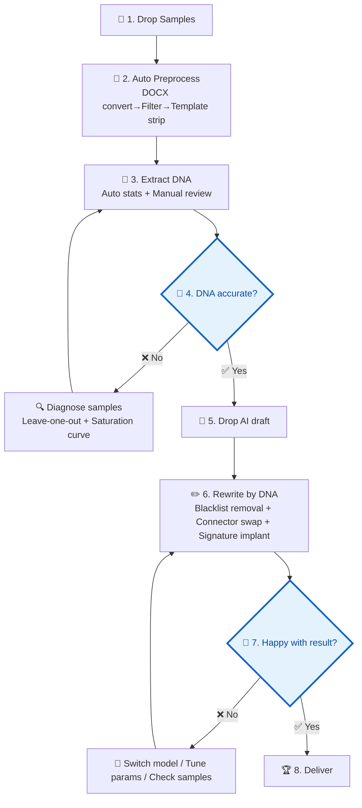

# Writing DNA · Your Personal Writing Style Guardian

[中文](https://github.com/dvdxfv/skill-writing-dna) | English

Make AI-generated content sound like **you** wrote it.

> 🔌 **Works with**: Trae / Cursor / Claude Code / VS Code (Copilot) / CodeX — five platforms, all adapted. Clone, then `pip install -r requirements.txt`, Python 3.10+.

---

## Workflow Overview

### One-Liner

```
Drop samples → Auto-process → ⏸️ Review DNA → Drop draft → Auto-rewrite → ⏸️ Review result → Done
```

**Only 2 points require your attention:**
- 🔵 **After DNA extraction** — Verify the profile is accurate
- 🔵 **After rewriting** — Confirm the result meets your standards

Everything else runs automatically.

---

### Full Flowchart



> 🔵 **Blue diamonds = mandatory human judgment points. The model cannot decide for you.**

<!-- Figure 1: AI Slop Detection -->

*Figure 1 · AI Slop Detection: higher score = stronger AI-flavor, details show which clichés were hit*

### 🔵 Step 4: Is the DNA Accurate? — 4 Items You Must Check

After extracting DNA, the model **stops and waits for your confirmation**. It displays everything directly in the conversation — no need to dig through files:

| # | What you'll see | How to judge | What to do if wrong |
|:---:|:---|:---|:---|
| 1 | Your top 15 high-frequency phrases (+ hotwords chart) | Any "I never say that"? Missing your go-to expressions? | Tell the model "XX is not mine, replace with YY" |
| 2 | "Avg X words per sentence, short sentences X%" | Does the rhythm match your writing? Do you prefer long or short sentences? | Tell the model "I usually write X words per sentence" |
| 3 | "The following are flagged as AI clichés you never use" | Did it falsely flag your pet phrases? | Point out false positives → model removes them from the blacklist |
| 4 | "Your articles typically open with… and close with…" | Do they match your usual openers/closers? | Copy your real openers/closers and send them to the model |

**If the DNA profile looks nothing like you** → Don't re-extract blindly. Run sample diagnostics first:
```bash
python scripts/test_sample_sufficiency.py
```
The test tells you: whether you need more samples, whether type diversity is the issue, or whether the extraction rules need tuning.

<!-- Figure 2: DNA Hotwords -->

*Figure 2 · DNA Hotwords: bigger text = higher frequency, instantly see your signature expressions*

---

### 🔵 Step 7: Happy with the Result? — 4 Items You Must Check

After rewriting and generating the comparison report, the model **stops and waits for your confirmation**:

| # | What you'll see | How to judge | What to do if wrong |
|:---:|:---|:---|:---|
| 1 | Side-by-side comparison + "AI-flavor score dropped from X to Y, removed Z clichés" | Read the rewrite — still smells like AI? Any "leverage/empower/ecosystem"? | Point out the lingering phrases → targeted rewrite |
| 2 | "Implanted your N signature phrases: XX, YY…" | Are they woven in naturally? Does it sound like you? | Flag awkward placements → adjust and re-run |
| 3 | Parallel view of original vs rewrite | Are facts, numbers, and conclusions all intact? Anything missing or distorted? | Point out lost info → restore |
| 4 | Full rewritten text | Can you publish/submit this as-is, or does it still need hand-editing? | "Needs minor fixes" → specify which paragraphs → spot-edit |

**If still not satisfied overall** → Troubleshoot in order:
1. **Is the DNA accurate?** — Re-check the hotwords chart and signature phrases. Did you approve too quickly in Step 4?
2. **Are samples sufficient?** — `python scripts/test_sample_sufficiency.py`
3. **Try a different model** — Model performance varies significantly for style rewriting

<!-- Figure 3: Before/After Comparison -->

*Figure 3 · Before/After: original on the left, rewritten on the right — AI-flavor reduction at a glance*

### ✅ Step 8: Delivery

Once you confirm satisfaction, the model delivers two outputs:

**Default: Markdown version** (`rewritten_draft.md`), ready for Obsidian, Typora, or any Markdown editor.

**The model also asks: "Want a DOCX version?"** If you use WPS / Word, say "yes" — it auto-converts to a formatted `.docx` with bold title headers + Song-style body text. Opens cleanly without the `#` `**` gibberish you get from pasting raw Markdown.

All outputs in `outputs/rewrite_runs/`:

| File | Use case |
|:---|:---|
| `report.md` | 📊 Before/after comparison report — read to verify quality |
| `rewritten_draft.md` | 📝 Final rewritten Markdown |
| `rewritten_draft.docx` | 📄 WPS/Word ready, formatted version (opt-in) |
| `rewrite_notes.md` | 📋 Rewrite process notes |
| `rewrite_debug.json` | 🔧 Detailed metrics (generally ignore) |

<!-- Figure 4: MD garbled in WPS vs DOCX conversion -->

*Figure 4 · MD Garbled vs DOCX: Left — Markdown pasted directly into WPS is unreadable. Right — auto-converted DOCX is clean and properly formatted.*

| MD pasted into WPS | DOCX after conversion |
|:---:|:---:|
|  |  |

---

## About Samples

### Recommended Sample Size

| Documents | Verdict | Total word count reference |
|:---:|:---|:---:|
| 1-4 | ❌ Too few — can't separate one-off habits from stable patterns | < 17K words |
| **5** | ⚠️ Minimum — stable features just emerging, many uncertain items | ~20K words |
| **8** | ✅ Optimal — uncertainties converge, most features confirmed | ~35K words |
| **12** | ✅ Ceiling — features saturated, marginal gains near zero | ~50K words |

> 💡 **Not sure if you have enough? Just run:**
> ```bash
> python scripts/test_sample_sufficiency.py
> ```
> The report shows leave-one-out variance and saturation curve results (see "Troubleshooting" below).

---

### Sample Diversity (Important!)

**Type diversity matters more than quantity.**

If you only submit one type of writing, the DNA gets contaminated by industry templates and fixed formats, drowning out your personal style.

#### ✅ Good Sample Mix

| Sample type | What it extracts |
|:---|:---|
| Analytical (reports, assessments, research) | Argument structure, institutional phrasing habits, data citation style |
| Planning/summary (work summaries, proposals) | Paragraph organization, summary patterns, itemized expressions |
| Public expression (articles, comments, speeches) | Flexibility, rhetorical preferences, tonal variation |
| Persuasive (proposals, petitions) | Persuasive writing techniques, nuance and restraint |

**Core principle: let the DNA extractor see you writing in different contexts, so it can separate "your style" from "industry boilerplate."**

#### ❌ Bad Sample Mix

```
❌ Same type × N documents       → DNA = industry template, not you
❌ Same project draft + final     → Near-duplicate content, counts as 1
❌ All co-authored pieces         → Second author's style mixed in
❌ All copy-paste templates       → Zero personal features extractable
```

#### Practical Tips

- Cover **3+ different** writing types
- From **different contexts or audiences**
- Prefer **sole-authored** works
- If you only have one type, at least ensure **time span > 6 months** (captures style evolution)

### File Format Support

| Format | How it works |
|:---|:---|
| `.docx` | Auto-converted (built-in DOCX→Markdown pipeline) |
| `.md` / `.txt` | Direct read |
| Pasting text | Separate multiple pieces with `---` |
| Folder | Auto-scans all `.docx` / `.md` / `.txt` files |

---

## About Models

### DNA Extraction Phase

DNA extraction primarily relies on **human analysis + cross-document comparison**, with little dependence on which LLM is used. Automated scripts (`scripts/test_sample_sufficiency.py`, `scripts/extract_dna.py`) assist but don't replace human judgment.

### DNA Rewriting Phase

Rewriting sensitivity varies significantly across models. Below are cross-model benchmark results:

#### Tested Models

| Model | Fit | Score | Reviewer | DNA Adherence | AI Slop Removal | Info Integrity | Style Similarity | Strategy |
|:---|:---:|:---:|:---|:---:|:---:|:---:|:---:|:---|
| **Claude Opus** | ⭐⭐⭐⭐ | 8.5 / 10 | DeepSeek V4 Pro | ⭐9.0 | 8.0 | ⭐9.0 | 8.5 | Structural transform |
| **ChatGPT 5.5** | ⭐⭐⭐⭐ | 8.3 / 10 | DeepSeek V4 Pro | 8.5 | 8.5 | ⭐9.0 | 8.0 | Balanced transform |
| **DeepSeek V4 Pro** | ⭐⭐⭐⭐ | 8.0 / 10 | ChatGPT 5.5 | 8.0 | 7.5 | 8.5 | 8.0 | Aggressive compression |
| **GLM 5V Turbo** | ⭐⭐ | 6.5 / 10 | DeepSeek V4 Pro | 6.5 | 6.0 | ⭐9.5 | 5.5 | Extremely conservative |
| **Kimi K2.6** | ⭐⭐ | 6.5 / 10 | DeepSeek V4 Pro | 6.5 | 6.0 | ⭐9.5 | 5.5 | Extremely conservative |
| **Qwen 3.6 Plus** | ⭐⭐ | 6.5 / 10 | DeepSeek V4 Pro | 6.5 | 6.0 | ⭐9.5 | 5.5 | Extremely conservative |
| **Qwen 3.5 Plus** | ⭐⭐ | 6.5 / 10 | DeepSeek V4 Pro | 6.5 | 6.0 | ⭐9.5 | 5.5 | Extremely conservative |

> Current best: Claude Opus (8.5), the first to achieve meaningful **format-level** rewriting — converting prose narration into enumerated structures. ChatGPT 5.5 (8.3) and DeepSeek V4 Pro (8.0) each excel in balance and compression respectively. All three significantly outperform the four conservative models (6.5).

#### Claude Opus Detailed Review

> **Reviewer**: DeepSeek V4 Pro · **Date**: 2026-05-17 · **Rewrite**: submitted as full text (user pasted), not saved to disk

Claude Opus employed a fundamentally different strategy — **structural transformation**. Rather than synonym replacement or paragraph compression, it converted prose narration into enumerated structures, directly fulfilling DNA rules 2 and 3:

- **DNA adherence 9.0**: First model to transform "prose passages → enumerated structure." Three key spots: implementation flow from long sentences to "first… second… third… fourth…"; key achievements from scattered phrases to enumerated summary; lessons learned from timeline to process-chain pattern. Directly hits DNA profile's core feature — "preference for enumerated transitions"
- **AI slop removal 8.0**: Policy background compressed while retaining necessary context; minor template residue ("urgently needs" etc.); clean overall, no hard-blacklist AI clichés found
- **Information integrity 9.0**: All key data preserved (15.18M, 6,782 person-times, 90.14 score, 12 enterprises, policy numbers, indicator scores, satisfaction breakdowns)
- **Style similarity 8.5**: The enumerated-structure conversion achieves style alignment at the "structural habit" level, not just word-level. "Relatively clear property rights, relatively distinct responsibilities" — the insertion of "relatively" reflects an institutional analyst's cautious tone, matching the DNA requirement to "avoid extreme claims / no superlative adverbs"
- **Rewrite innovation 8.5**: Not synonym replacement, not compression — **structural adjustment** identifying which paragraphs suit enumerated expression and executing the conversion

**Conclusion**: Claude Opus (8.5) is the top performer. The key differentiator: format-level rewriting — converting prose into DNA-specified enumerated structures, beyond what any previous model achieved.

**Limitation**: Output truncated at the final recommendations section. Above evaluation based on 3,000+ characters of received output.

#### ChatGPT 5.5 Detailed Review

> **Reviewer**: DeepSeek V4 Pro · **Date**: 2026-05-17 · **Rewrite**: `outputs/model_benchmarks/chatgpt_5_5_rewritten.md` · **AI Slop Detection**: `outputs/model_benchmarks/chatgpt_5_5_slop_report.json` (score 1/100, original input 2/100)

ChatGPT 5.5 used a **balanced transformation** strategy — finding a better equilibrium between style conversion and information preservation than DeepSeek V4 Pro:

- **DNA adherence 8.5**: Judgment-led openers well executed; recommendations strictly follow "recommendation + subject + action + content" format; problem analysis uses "first… second… third…" enumeration; foundational chapters show slightly weaker style conversion than problem/recommendation chapters
- **AI slop removal 8.5**: Detection score only 1/100 (original 2/100). The 11 hits are all policy document fixed phrases or neutral bureaucratic terms — not typical AI clichés; hard-blacklist words ("empower/reshape/ecosystem/one-stop/in summary") all absent
- **Information integrity 9.0**: All key data fully preserved; no over-compression issue seen with DeepSeek V4 Pro
- **Style similarity 8.0**: Problem analysis and recommendation sections closest to DNA profile; policy background section still has some generic bureaucratic expressions
- **Rewrite innovation 7.5**: Primarily restructures sentences, compresses redundancy, strengthens judgment sentences, rather than major paragraph restructuring; strategy is steady — advantage is readability and minimal manual restoration needed

**Conclusion**: ChatGPT 5.5 (8.3) is the best balanced performer. Best choice for daily rewriting with minimal manual review. For more aggressive style breakthroughs, choose Claude Opus or DeepSeek V4 Pro.

#### DeepSeek V4 Pro Detailed Review

> **Reviewer**: ChatGPT 5.5 · **Date**: 2026-05-17 · **Input**: `outputs/dna_profiles/user_dna_profile.md` + `outputs/rewrite_runs/new_ai_draft_effective_input.md`

DeepSeek V4 Pro clearly differs from the four conservative models, taking an "aggressive compression + style conversion" approach:

- **DNA adherence 8.0**: Effectively implements judgment-openers, parallel expansion, institutional recommendations, and normative tone; template-heavy chapters retain more original organization
- **AI slop removal 7.5**: Deleted or compressed grandiose backgrounds, repetitive policy language, and empty modifiers; some generic bureaucratic expressions remain
- **Information integrity 8.5**: Core facts preserved; evaluation rationale, work process, some satisfaction breakdowns, and milestone details compressed — minor information loss
- **Style similarity 8.0**: Compared to original, stronger emphasis on "judgment + fact support + institutional recommendation"; some chapters weakened in comprehensive report format to achieve brevity
- **Rewrite innovation 8.0**: Beyond synonym replacement — actively adjusts paragraph density, removes template noise, restructures problem and recommendation expressions

**Conclusion**: DeepSeek V4 Pro (8.0) is the first tested model to achieve genuine style transformation. Best used as a "second-pass style rewriter." Recommended workflow: conservative model for fact-checking → DeepSeek V4 Pro for style compression → manual restoration of over-compressed sections.

#### Conservative Models — Collective Conclusion

The following four models show highly consistent behavior: prioritize information safety, suitable as fact-preservation validators, not as primary rewriting models.

#### Qwen 3.6 Plus / 3.5 Plus Detailed Review

Both Qwen models show identical results — "extremely conservative" strategy:

- **DNA adherence 6.5**: All 8 rules formally followed, but output barely differs from input — no DNA-driven style transformation
- **AI slop removal 6.0**: Original text is bureaucratic prose with inherently low AI-cliché baseline; actual cleaning marginal
- **Information integrity 9.5**: All key data perfectly preserved — zero loss
- **Style similarity 5.5**: Output highly similar to original — core issue: input and DNA-source samples share the same genre, model defaults to "better safe than sorry"
- **Rewrite innovation 4.0**: Fine-tuning rather than rewriting; lacks style-driven proactive transformation

**Conclusion**: Qwen, Kimi, and GLM models all demonstrate "extremely conservative" behavior on bureaucratic rewriting tasks — perfect information fidelity but zero style improvement. Best used as "first-pass safety validators." Core rewriting should be handled by more aggressive models.

#### Benchmark Summary

**7 models tested**, results fall into three tiers by strategy:

| Tier | Model | Score | Strategy | Role |
|:---:|:---|:---:|:---|:---|
| 🥇 | **Claude Opus** | **8.5** | Structural transform | Primary rewriter — format-level rewriting |
| 🥈 | **ChatGPT 5.5** | 8.3 | Balanced transform | Primary rewriter — best balance of style & info |
| 🥉 | **DeepSeek V4 Pro** | 8.0 | Aggressive compression | Secondary rewriter — boldest style, needs manual restoration |
| — | GLM 5V Turbo | 6.5 | Extremely conservative | Safety validator — zero info loss, zero style change |
| — | Kimi K2.6 | 6.5 | Extremely conservative | Safety validator — same |
| — | Qwen 3.6 Plus | 6.5 | Extremely conservative | Safety validator — same |
| — | Qwen 3.5 Plus | 6.5 | Extremely conservative | Safety validator — same |

**Key findings:**

1. **Information safety and style transformation are trade-offs** — no model achieves 9.0+ on both dimensions simultaneously
2. **Three levels of rewriting exist**: word-level substitution (conservative models) → paragraph restructuring (DS V4 Pro, ChatGPT 5.5) → format-level transformation (Claude Opus)
3. **Same-genre input is a critical variable**: when the rewrite input and DNA-source samples share the same genre, models default to "better safe than sorry" — the root cause of conservative models scoring 6.5
4. **AI slop detection has limited reference value**: original text already contains bureaucratic boilerplate (not typical AI clichés), making detection scores indistinguishable across models (1-2/100)

#### Model Selection Guide

| Scenario | Recommended Model | Reason |
|:---|:---|:---|
| Daily rewriting, ready to use | **ChatGPT 5.5** | Best balance, minimal manual review |
| Maximum style breakthrough | **Claude Opus** | Only model doing format-level rewriting, highest DNA adherence |
| Budget-sensitive / high volume | **DeepSeek V4 Pro** | Best cost-performance, aggressive compression + manual restoration |
| Fact-preservation validation | Qwen / Kimi / GLM | Zero information loss, ideal first-pass safety check |

> Each model's score was independently cross-reviewed by a different model to ensure objectivity. Full benchmark design and process records in `PROJECT_STATUS.md`.

---

## What If It Doesn't Work?

DNA profile inaccurate? Rewrite doesn't sound like you? **Troubleshoot in order — don't blindly add samples or switch models.**

### Troubleshooting Flow

```
Problem appears
   ↓
① Run sample sufficiency test → Not enough? → Add diverse samples → Re-extract
   ↓ OK
② Run template profile check → Stripping issues? → Adjust strip_template rules → Re-strip + re-extract
   ↓ OK
③ Check DNA rules → Rules wrong? → Manually adjust DNA JSON → Re-rewrite
   ↓ OK
④ Switch model / tune params → Re-run rewrite
```

### ① Sample Sufficiency Test

**Symptom**: DNA features are sparse, generic, or "this doesn't feel like me"

```bash
python scripts/test_sample_sufficiency.py
```

Report output to `outputs/debug/sample_sufficiency_test.md`. Check these two metrics:

| Metric | ✅ Normal | ⚠️ Watch | ❌ Problem |
|:---|:---|:---|:---|
| **Leave-one-out variance** | < 0.05 | 0.05 ~ 0.15 | > 0.15 |
| **Saturation curve** | Plateaued | Near plateau | Still rising |

**Actions by result:**

- **❌ High variance + curve not saturated** → Not enough samples. Add **2-3 different types** of documents, then re-run `run.py extract`
- **⚠️ Moderate variance + curve near plateau** → Basically usable, but some features unstable. Continue to step ②
- **✅ Low variance + curve saturated** → Samples are fine. Issue is elsewhere. Go to step ②

### ② Template Stripping Check

**Symptom**: DNA mixed with lots of boilerplate/formatted content, or too few features extracted

```bash
python scripts/extract_template_profile.py --input inputs/filtered_markdown/*.md --output-json outputs/debug/template_profile.json --output-md outputs/debug/template_profile.md
```

Check **average retention rate** in `template_profile.md`:

| Retention | Meaning | Action |
|:---:|:---|:---|
| **< 30%** | Over-stripping — personal content removed | Edit `scripts/strip_template.py`, remove/relax over-aggressive rules, re-run pipeline + extract |
| **30% ~ 70%** | Normal range | Continue to step ③ |
| **> 70%** | Under-stripping — template noise in DNA | Edit `scripts/strip_template.py`, add missing template patterns (check "cross-document repeated paragraphs" in report), re-run |

> 💡 The report's "template-level headings" and "personal-content headings" classification shows what was excluded and what was retained.

### ③ DNA Rule Check

**Symptom**: Samples and templates are fine, but the rewrite still doesn't sound like you

Open `outputs/dna_profiles/<your-name>-dna.json` and check each rule:

| Check item | Problem indicator | Adjustment |
|:---|:---|:---|
| **Sentence length** | Rewritten sentences vary wildly | Check if `sentence_length` range matches your originals |
| **Connector preferences** | Unfamiliar connectors appear | Check if `connectors` blacklist/whitelist is complete |
| **Signature phrases** | Not implanted or placed awkwardly | Check if `signature_phrases` has enough example sentences |
| **Institutional/high-freq words** | Word choice deviates significantly | Check if `vocabulary_preferences` dictionary is accurate |

After manually editing the DNA JSON, re-run:

```bash
python run.py rewrite
```

### ④ Model & Parameter Tuning

**Symptom**: Above three steps all confirmed OK, but rewrite quality still unsatisfactory

Try in priority order:

1. **Switch model** — Different models vary significantly in rule adherence:
   - Claude: Strictest rule following
   - ChatGPT: Best information preservation
   - DeepSeek: Best cost-performance

2. **Tune parameters** — Edit `config.yaml`:
   - `rewrite_aggressiveness`: lower = more conservative (closer to original), higher = more aggressive (closer to your style)
   - `signature_density`: signature phrase implant density

3. **Check input draft** — Ensure the AI draft itself is information-complete, no missing sections

### Quick Diagnosis Table

| Problem | Most likely cause | Run this first |
|:---|:---|:---|
| DNA features sparse/generic | Insufficient samples or too-narrow types | ① Sample sufficiency test |
| DNA full of boilerplate/templates | Templates not stripped clean | ② Template profile check |
| DNA extracted but rewrite doesn't match | DNA rules need tuning | ③ DNA rule check |
| Significant information loss after rewrite | Model too aggressive | ④ Switch to conservative model |
| Minimal style change after rewrite | Model too conservative or params too low | ④ Increase aggressiveness / switch model |

---

## Limitations

This tool changes **how you write**, not **what structure you wrote**. Please understand the following limitations to avoid unrealistic expectations:

### What It Cannot Do

| Limitation | Reason |
|:---|:---|
| **Cannot restructure across headings** | Rewriting operates within paragraph/heading units; doesn't move or reorder chapters |
| **Cannot preserve original DOCX formatting** | DOCX→MD conversion loses fonts, sizes, margins. Final DOCX uses default Chinese formatting template |
| **Cannot guarantee 100% heading level accuracy** | If the original didn't use WPS/Word outline styles, heading recognition relies on text-pattern inference |
| **Cannot process images, charts, attachments** | Removed during text cleaning phase |

### Delivery Format

After confirming satisfaction, two files are delivered:

| Format | Use case |
|:---|:---|
| `.md` | Plain text reading, version control, further editing |
| `.docx` | WPS / Word direct open, formatted presentation |

DOCX is generated by `scripts/md_to_docx.py` (requires pandoc), auto-configured with bold title font + Song-style body text, opens cleanly in WPS without garbled characters.

---

## Quick Start

> **Supported AI coding tools**: Trae / Cursor / Claude Code / VS Code Copilot / CodeX — the project's `WRITING_DNA.md` is synced to each platform's rules directory (`.cursor/rules/`, `.claude/`, `.github/`, `.codex/rules/`). Python scripts are universal. Open the project and it just works.

### Step 1: Install

```bash
# Clone the project
git clone <repo-url>
cd skill-writing-dna

# Install dependencies (Python 3.10+)
pip install -r requirements.txt
```

> **Dependencies**: `mammoth` for DOCX→Markdown conversion, `markdownify` for HTML→Markdown, `matplotlib` + `Pillow` for DNA feature cloud visualization, `PyYAML` for config parsing.

### Step 2: Drop Your Samples

Place your **5-8 past writings** into `inputs/raw_docx_articles/`. Supports `.docx` / `.md` / `.txt`.

### Step 3: One-Click Run

```bash
# Check current status and next-step suggestion
python run.py status

# Run full preprocessing pipeline (convert → filter → template strip)
python run.py pipeline

# Extract DNA
python run.py extract --user-name YourName

# Place AI draft in inputs/ai_drafts/, then rewrite
python run.py rewrite
```

### Step 4: Check Output

| Output | Path |
|:---|:---|
| DNA profile (JSON) | `outputs/dna_profiles/<YourName>-dna.json` |
| DNA hotwords chart (PNG) | `outputs/dna_profiles/<YourName>-dna_hotwords.png` |
| Rewritten final draft | `outputs/rewrite_runs/rewritten_draft.md` |
| Rewrite debug info | `outputs/rewrite_runs/rewrite_debug.json` |

### Advanced: Per-Script Invocation

For finer control, call each script individually:

```bash
# Preprocessing pipeline
python scripts/docx_to_md.py --input inputs/raw_docx_articles/*.docx --output-dir inputs/normalized_markdown
python scripts/filter_non_prose.py --input inputs/normalized_markdown/*.md --output-dir inputs/filtered_markdown
python scripts/strip_template.py --input inputs/filtered_markdown/*.md --output-dir inputs/template_stripped_markdown

# Sample sufficiency diagnostics (optional, recommended for 5+ samples)
python scripts/test_sample_sufficiency.py

# Template profile extraction (optional, check template vs personal style boundary)
python scripts/extract_template_profile.py --input inputs/filtered_markdown/*.md --output-json outputs/debug/template_profile.json --output-md outputs/debug/template_profile.md

# DNA extraction
python scripts/extract_dna.py --input inputs/template_stripped_markdown/*.md --user-name YourName --output outputs/dna_profiles/YourName-dna.json

# DNA feature cloud visualization
python scripts/render_dna_feature_cloud.py

# AI slop detection (optional)
python scripts/detect_ai_slop.py --text inputs/ai_drafts/your-draft.md --dna outputs/dna_profiles/YourName-dna.json

# Rewrite by DNA
python scripts/rewrite_with_dna.py --draft inputs/ai_drafts/your-draft.md --dna outputs/dna_profiles/YourName-dna.json --output-md outputs/rewrite_runs/rewritten_draft.md --output-json outputs/rewrite_runs/rewrite_debug.json

# Generate comparison report
python scripts/generate_report.py --original inputs/ai_drafts/your-draft.md --rewritten outputs/rewrite_runs/rewritten_draft.md --dna outputs/dna_profiles/YourName-dna.json --debug-json outputs/rewrite_runs/rewrite_debug.json --output-md outputs/rewrite_runs/report.md
```

---

## Project Structure

```
├── inputs/
│   ├── raw_docx_articles/      ← Your original DOCX files
│   ├── normalized_markdown/    ← DOCX converted to Markdown
│   ├── filtered_markdown/      ← Non-prose filtered
│   ├── template_stripped_markdown/ ← Template stripped (DNA extraction input)
│   └── ai_drafts/              ← AI drafts (for rewrite comparison)
│
├── outputs/
│   ├── dna_profiles/           ← DNA main output + feature cloud
│   ├── rewrite_runs/           ← Rewrite results + notes
│   └── debug/                  ← Test reports (saturation / leave-one-out)
│
├── scripts/                    ← Processing scripts
├── docs/                       ← Project design docs
├── .cursor/rules/              ← Cursor rules (auto-loaded)
├── .claude/                    ← Claude Code instructions
├── .github/                    ← VS Code Copilot instructions
├── .codex/rules/               ← CodeX rules
├── SKILL.md                    ← Full skill workflow (Trae native format)
└── WRITING_DNA.md              ← Cross-platform universal instructions (no Trae header)

---

## Recommended Reading

- [SKILL.md](SKILL.md) — Full skill workflow definition (Trae native format)
- [WRITING_DNA.md](WRITING_DNA.md) — Cross-platform universal instructions (Cursor / Claude Code / VS Code / CodeX shared)
- [PROJECT_STATUS.md](PROJECT_STATUS.md) — Project progress, resource consumption, pending items
- [docs/writing-dna-architecture.md](docs/writing-dna-architecture.md) — System architecture

---

## Screenshots

4 images in the README, all located in `docs/images/`:

| Figure | Image file | Section |
|:---:|:---|:---|
| Fig 1 | `ai_slop_report.png` | Below flowchart · AI slop detection |
| Fig 2 | `user_dna_hotwords_example.png` | After Step 4 DNA confirmation · Hotwords cloud |
| Fig 3 | `comparison_report.png` | After Step 7 result confirmation · Before/after comparison |
| Fig 4 | `md_raw_wps_garbled.png` + `wps_docx_effect.png` | Step 8 Delivery · MD garbled vs DOCX formatted |